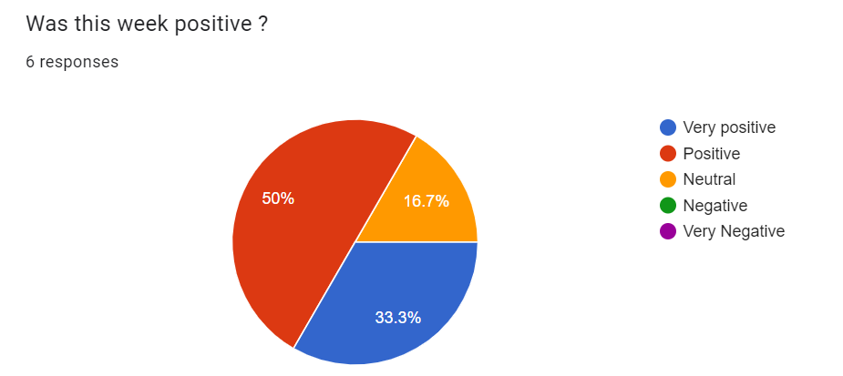
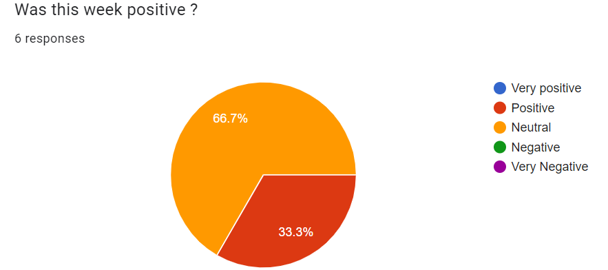

# Global Report

This file will contain all the weekly reports in one documents to make it easier for reviewers to read.

Table of contents

- [Weekly Report Cumulative](#weekly-report-cumulative)
  - [Scope](#scope)
  - [Weekly Report - Week 1](#weekly-report---week-1)
    - [Overview](#overview)
    - [Accomplishments](#accomplishments)
    - [Challenges](#challenges)
    - [Plan for Next Week](#plan-for-next-week)
    - [Conclusion](#conclusion)
  - [Weekly Report - Week 2](#weekly-report---week-2)
    - [Overview](#overview-1)
    - [Accomplishments](#accomplishments-1)
    - [Challenges](#challenges-1)
    - [Plan for Next Week](#plan-for-next-week-1)
    - [Conclusion](#conclusion-1)
  - [Weekly Report - Week 3](#weekly-report---week-3)
    - [Overview](#overview-2)
    - [Accomplishments](#accomplishments-2)
    - [Challenges](#challenges-2)
    - [Plan for Next Week](#plan-for-next-week-2)
    - [Conclusion](#conclusion-2)
  - [Weekly Report - Week 4](#weekly-report---week-4)
    - [Overview](#overview-3)
    - [Accomplishments](#accomplishments-3)
    - [Challenges](#challenges-3)
    - [Plan for Next Week](#plan-for-next-week-3)
    - [Conclusion](#conclusion-3)
  - [Weekly Report - Week 5](#weekly-report---week-5)
    - [Overview](#overview-4)
    - [Accomplishments](#accomplishments-4)
    - [Challenges](#challenges-4)
    - [Plan for Next Week](#plan-for-next-week-4)
    - [Conclusion](#conclusion-4)
  - [Weekly Report - Week 6](#weekly-report---week-6)
    - [Overview](#overview-5)
    - [Accomplishments](#accomplishments-5)
    - [Challenges](#challenges-5)
    - [Plan for Next Week](#plan-for-next-week-5)
    - [Conclusion](#conclusion-5)

# Weekly Report - Week 1

## Overview

This week was the first week of the project, which means the team mostly focused on figuring out what algorithm to use and how, as well as verifying the data. This weekly report will cover this week's objectives, a report on the team's morale, our advancements on the objectives and any extras the team has done, the challenges the team has faced, and our plan for next week.

## Week 1 Objectives

1. **Data verification**
 - We wanted to verify the dataset to confirm the absence of extra or isolated paths and cycles.
2. **Algorithm choice**
 - We wanted to choose what algorithm we would base our work on.
3. **Funcional specification**
 - We wanted a skeleton for the document to allow the Program manager to start adding content.
4. **Planning/Deadlines**
 - Since there are no fixed deadlines for the project, we wanted to set deadlines for ourselves so as not to end up doing everything at the last minute. We also wanted a plan to know what to focus on.

## Team Morale
Here is a graph representing the teams satisfaction for the first week.  
 

## Project advancements

1. **Data verification**
 - We have verified the data. There are no extra or isolated paths and no cycles.
2. **Algorithm choice**
 - We narrowed down the algorithm we want to use to a few choices but still have not been able to come to an agreement.
3. **Funcional specification**
 - We have a skeleton for the document. However, the document does not have the expected amount of content.
4. **Planning/Deadlines**
 - We have fixed deadlines and created a schedule to ensure good coordination in the team using a Gantt Chart for deadlines and a RACI matrix for responsibility.

## Extras

1. **REST API**
 - To avoid burnout from only working on algorithms for days on end, some team members looked into REST APIs. Thanks to that, we have already hosted a server and a skeleton for our REST API. However, we know we cannot move forward until we have completed the algorithm. Therefore, we will fully focus on the algorithm before pursuing the REST API.

## Challenges

1. **Absences**
 - Our Software engineer was absent for the whole first week, and our program manager was absent 3/5 of the time due to no fault of their own, which caused morale issues for the team.
2. **Learning about algorithms and C++**
 - C++ is a common language, but some team members have never used it before, so we need to learn it. Most of the team also didn't know about the different types of algorithms, so we had to spend a lot of time researching algorithms to find one we could use.
3. **Rejection**
 - Our team tried to solve the problem by reorganizing the data, allowing us to go through it more easily. However, we were chastised for tampering with the data. This meant our previous work had been wasted, which hurt our morale as we had worked on that solution for a while.

## Plan for Next Week

1. **Complete Functional Specifications**
 - We want to have completed the Functional Specifications soon to allow the team to work on other documents.
2. **Finish choosing an algorithm**
 - Before the end of next week, no matter what, we will have chosen an algorithm to allow us to get to work.
3. **Start working on the code**
 - We need to start working on the code early to allow us to do extensive testing, this will help us avoid issues in the long run.

## Conclusion

The project has had a promising start with strong team spirit and effective communication. Even with the absences, our team should stay strong until the end of the project. We are all optimistic.

---

# Weekly Report - Week 2

## Overview

## Week 2 Objectives

1. **Functional specifications**
 - We wanted to complete the functional specifications document.
2. **Direction**
 - We wanted to finish deciding what the team should work on moving forward, meaning what algorithm we should use and how we should implement it.
3. **Code**
 - We wanted to start working on the code early.

## Team Morale
Here is a graph representing the team's satisfaction for the second week.  
 

## Project advancements

1. **Functional specifications**
 - The functional specifications are not finished.
2. **Direction**
 - After thoroughly examining the call for tender, we realized that we are allowed to do a huge amount of preprocessing. Preprocessing would make the project significantly easier. Even though the team really dislikes preprocessing, it is a required step if we want to complete the project on time while still following the call for tender.
3. **Code**
 - We have some code that we were able to test.

## Challenges

1. **Absences**
 - Our Software engineer was absent for 1/3 of the project time, thus dragging the morale team's morale down.
2. **Realization**
 - As stated during the [Project advancements](#project-advancements), the team spent a while choosing how to go forward. The final decision did not make everyone happy.

## Plan for Next Week

1. **Complete Techincal Specifications**
 - We aim to finalize the Technical Specifications promptly so the technical leader can resume assisting the team with coding.
2. **Finish the algorithm**
 - Before the end of next week, it is imperative that we finish a working version of the algorithm with, which would allow us to complete the REST API.

## Conclusion

The team's morale went down after realizing just how difficult finding a result in under a second would be. We have decided how to move forward.

---

# Weekly Report - Week 3

## Overview

## Week 3 Objectives

1. **Techincal Specifications**
 - We wanted to complete the technical specifications document.
2. **Finish the algorithm**
 - We wanted to finish the algorithm to allow the team to finish the REST API.

## Team Morale
Here is a graph representing the team's satisfaction for the third week.  
 

## Project advancements

1. **Techincal Specifications**
 - The technical specifications are nearly finished.
2. **Finish the algorithm**
 - We have not been able to finish the algorithm as the software engineer was yet again not here. The software engineer has written no lines of code since the beginning of the project, which is angering the team.

## Challenges

1. **Absences**
 - The team's morale hit an all-time low on Wednesday when the software engineer, who had left on Monday morning, returned to tell us he would not be there for the rest of the week and left again.
2. **Code**
 - The software engineer has not written any code. All the code we do have was written by other members. We are lagging as we need to take care of our documents. The team is fed up.

## Plan for Next Week

1. **Complete Techincal Specifications**
 - We aim to finalize the Technical Specifications.
2. **Advancing on the code**
 - Since some documents are completed, we could try to focus on writing more of the code.
3. **Talking to our superiors about the software engineer's absence**
 - The software engineer told us he would be back next week. If he isn't back by the break on Monday, the team will talk to Franck.

## Conclusion

The team's morale is extremely low due to the absence and lack of work of the software engineer. The documents are moving along. The code is seriously lacking.

---

# Weekly Report - Week 4

## Overview

## Week 4 Objectives

1. **Complete Techincal Specifications**
 - We wanted to finalize the Technical Specifications.
2. **Advancing on the code**
 - Since some documents had been completed, we wanted to focus on writing more of the code.
3. **Talking to our superiors about the software engineer's absence**
 - The team wanted to talk to Franck about the software engineer's absence.

## Team Morale
Here is a graph representing the team's satisfaction for the fourth week.  
 

## Project advancements

1. **Complete Techincal Specifications**
 - We were hoping to finish the Technical Specifications, however, we realized that there are still many different parts of the algorithms that will require changes in the document. It will be completed on Thursday or Friday of next week.
2. **Advancing on the code**
 - We managed to advance a lot on the code. Nearly all of the team worked on the code for this week. Not everyone could work on the algorithm at the same time, which meant some of us had to work on the server. It can receive a GET request, run the algorithm, and return results in XML or JSON format. The algorithm was also considerably improved, with the response for the longest path going down from 37 seconds to 13 seconds. Then, the technical leader talked to team 6 and they showed us a new way to compile the code which made the longest path go down from 13 
3. **Talking to our superiors about the software engineer's absence**
 - We went to talk to Franck, and he said that we should transform either the technical writer or the program manager into a software engineer. But before the team could decide who would become a software engineer. Ian came back and did some work, so we didn't think it necessary anymore to have someone take his role over. However, if the same thing were to happen for another project, I would make another group member a software engineer at the start of the project.

## Challenges

1. **Morale recovery**
 - The team's morale was very low at the end of the third week. The team needed time to reset mentally.

## Plan for Next Week

1. **Finish the code**
 - We need to finish the algorithm.
2. **Finishing the technical specifications**
 - Once the algorithm is complete, we need to finish the technical specifications.

## Conclusion

The deadline is approaching, and we have not finished just yet. We need to optimize the algorithm further to reach the desired outcome of a response under 1 second.

---

# Weekly Report - Week 5

## Overview

## Week 5 Objectives

1. **Finish the code**
 - We needed to finish the algorithm.
2. **Finishing the technical specifications**
 - Once the algorithm is complete, we needed to finish the technical specifications.

## Team Morale
Here is a graph representing the team's satisfaction for the fifth week.  
 

## Project advancements

1. **Finish the code**
 - We managed to fully optimize the algorithm, it returns a reponse in an acceptable time. The server also returns a response in less than a second on MacOS and in about two seconds on Windows.
2. **Finishing the technical specifications**
 - The technical specifications have been finished in accordance to the new algorithm.

## Challenges

1. **Morale recovery**
 - The team's morale is ok but we were also very stressed as we finished the project in the nick of time.
2. **Absences**
 - The Technical Writer was absent on the last two days, the Program Manager was absent on thursday and the Software engineer was absent on the first two days.

## Plan for Next Week

1. **Work on the presentation**
 - We need to prepare our presentation for next friday.
2. **Tying up loose ends**
 - We need to clean up a few parts of the code.

## Conclusion

We managed to finish the project, the API returns a response within the desired timeframe of under a second. All we need now is to work on the pitch.