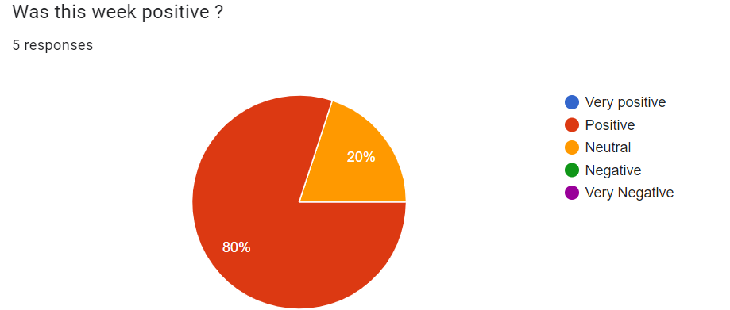

# Weekly Report - Week 6

## Overview

## Week 6 Objectives

1. **Work on the presentation**
 - We needed to prepare our presentation for this friday.
2. **Tying up loose ends**
 - We needed to clean up a few parts of the code.

## Team Morale
Here is a graph representing the team's satisfaction for the sixth week.  
 

## Project advancements

1. **Work on the presentation**
 - We worked on the presentation throughout the whole week, and I believe we have prepared well, there a few timing issues but apart from that, everything is done.
2. **Tying up loose ends**
 - The code has been cleaned, comments have been added and there are even some improvements. Especially since we discovered that the client didn't work on windows, so a working version was added.

## Challenges

1. ****
 - The team's morale is ???.
2. **Structuring the presentation**
 - The team struggled fitting everything that needed to be said about this project in a fifteen minute presentation, while still making it understandable.

## Plan for Next Week

There is no plan for next week as the project is over.

## Conclusion

We managed to finish the project, the API returns a response within the desired timeframe of under a second. All we need now is to work on the pitch.

THINGS TO ADD:
Stress-testing