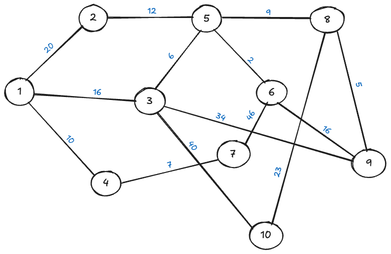

<details>

<summary> Table of content </summary>

- [Introduction](#introduction)
- [Test objectives](#test-objectives)
    - [Validate functional accuracy](#validate-functional-accuracy)
    - [Ensure performance](#ensure-performance)
    - [Check data integrity](#check-data-integrity)
    - [Verify REST API compliance](#verify-rest-api-compliance)
    - [Alignment with specifications](#alignment-with-specifications)
- [Testing scope](#testing-scope)
  - [In scope](#in-scope)
    - [Documentation](#documentation)
    - [Data](#data)
    - [Algorithm](#algorithm)
    - [REST API](#rest-api)
    - [Code](#code)
    - [Test suite](#test-suite)
  - [Out of scope](#out-of-scope)
    - [Security](#security)
    - [UI design](#ui-design)
- [Testing sample](#testing-sample)
  - [Sample data](#sample-data)
- [Data verification](#data-verification)
  - [Breadth First Search (BFS)\[^21\]](#breadth-first-search-bfs21)
    - [Depth First Search (DFS)\[^22\]](#depth-first-search-dfs22)
  - [Isolated nodes](#isolated-nodes)
  - [Isolated edges](#isolated-edges)
  - [Expected output](#expected-output)
- [The algorithm](#the-algorithm)
  - [Correctness verification](#correctness-verification)
  - [Scalability](#scalability)
  - [Edge cases](#edge-cases)
  - [Regression tests](#regression-tests)
  - [Success criteria](#success-criteria)
- [The REST API](#the-rest-api)
  - [Primary endpoint: `GET /path`](#primary-endpoint-get-path)
  - [Testing objectives](#testing-objectives)
  - [HTTP methods and status codes](#http-methods-and-status-codes)
  - [Tools](#tools)
  - [Expected outcomes](#expected-outcomes)
- [Test cases](#test-cases)
  - [ID creation](#id-creation)
- [Environments and tools](#environments-and-tools)
  - [Environments](#environments)
  - [Tools](#tools-1)
    - [Testing tools](#testing-tools)
    - [Development and version control tools](#development-and-version-control-tools)
    - [Monitoring and profiling tools](#monitoring-and-profiling-tools)
- [Risks and assumptions](#risks-and-assumptions)
  - [Risks](#risks)
  - [Assumptions](#assumptions)
- [GitHub issues](#github-issues)
  - [Workflow](#workflow)
  - [Types of issues](#types-of-issues)
  - [Example issue template](#example-issue-template)
- [Continuous integration (CI/CD)](#continuous-integration-cicd)
  - [GitHub actions](#github-actions)
  - [Workflows](#workflows)
    - [Build workflow](#build-workflow)
    - [Test workflow](#test-workflow)
    - [Unit Tests in CI/CD](#unit-tests-in-cicd)
  - [Reporting](#reporting)
- [Urgency plan](#urgency-plan)
  - [Scenarios and responses](#scenarios-and-responses)
    - [Prioritization and escalation](#prioritization-and-escalation)
- [References](#references)

</details>

# Introduction

This **test plan** provides a concise overview of the strategies, methods, and resources used to verify the functionality, performance, and reliability of the **2024–2025 Project 3: Call for Tender** software solution.

Designed to calculate the quickest path between two landmarks in the United States, the solution combines a **C++** back-end and a **REST API**[^1] with support for **XML and JSON** outputs. Given the stringent requirement to respond within **1 second** for large-scale datasets, ensuring the chosen path is within **10%** of the absolute shortest route.

This plan details how the testing team will validate data integrity, measure algorithmic efficiency, and confirm conformance with functional and technical specifications.

# Test objectives

### Validate functional accuracy

- Confirm that the algorithm reliability provides the quickest route between any two U.S. landmarks.

### Ensure performance

- Verify that all valid requests receive a response in under one second, even when handling a dataset[^2] of approximately 24 million nodes.

### Check data integrity
<!-- todo link to the csv -->

- Validate the integrity of the CSV file (e.g., USA-roads.csv)
- Verifying graph structure, ensuring it's free of loops[^4], and confirming full connectivity[^5] between landmarks.

### Verify REST API compliance

- Confirm that the single GET[^19] endpoint[^20] correctly accepts source/destination IDs.
- Return both XML and JSON formats.
- Handles error conditions gracefully.

### Alignment with specifications 

- Confirm that all tested functionalities map to the requirements outlined in the project's functional and technical specifications.

# Testing scope

## In scope

### Documentation

- Verify that the documentation is accurate, consistent, and maps to the software's features.

### Data

- Input file (USA-roads.csv).
	- Confirm the ability to detect isolated nodes/edges[^6] and verify full connectivity where expected.
- Data reorganisation tool.
	- Ensure the correctness of the JSON outputs and confirm adjacency[^7] is built accurately.
### Algorithm

- Test correctness.
- Evaluate performance under varying loads.
	- Small vs. large datasets.
- Validate time/space complexity[^8] claims.

### REST API

- Get endpoint.
	- Validate correct handling of source/destination IDs, return formats (XML[^9] & JSON[^10]), and response codes.
	- Confirm a 1-second response time for typical requests on an average laptop[^11].
- Endpoint compliance.
	- Check error/exception handling(e.g., invalid or missing parameters).
- Robustness.
	- Confirm the system maintains performance under typical and moderate stress conditions.
	- Ensure the handling of the degradation in case of partial system failures.

### Code

- Static code analysis.
	- Checking for memory leaks[^13] and performance bottlenecks[^14].
- Validate standard compliance and minimal dependencies.
	- Only STL[^18] + required Web server libraries.

### Test suite

- Unit test coverage.
    - Unit, integration, and system-level tests for the algorithm and REST API.
    - Regression tests ensure new changes don’t break existing functionality.
- Automation.
    - Confirm that tests can be run via a CI/CD[^15] pipeline (e.g., GitHub Actions).

## Out of scope

### Security

- Authentication, authorisation, and penetration testing for the API are **not covered** in this test plan.

### UI design

- Any graphical or front-end interface design is **not part** of the testing scope, as the primary interface is the REST API.

# Testing sample

A sample dataset[^16] serves as a small graph with clearly defined edges and travel times. 
- Shortest path accuracy.
	- Easily trace individual routes and confirm whether the algorithm identifies the quickest path.
- Connectivity verification.
	- Visualise the entire graph to ensure proper connectivity and spot potential cycles[^17].
- Input/output validation.
	- Keep file parsing straightforward and confirm the adjacency list.
	- Confirm it generates the expected output formats (JSON and XML).

## Sample data

```
1,2,20
1,3,16
1,4,10
2,5,12
5,8,9
3,5,6
3,10,40
4,7,7
10,8,23
7,6,46
3,9,34
5,6,2
8,9,5
6,9,16
```

- Total nodes: 10.
- Edges: 14.
- Travel time: From 2 to 46.




# Data verification

This program analyses the CSV input to confirm that the graph meets the fundamental criteria for valid pathfinding.

## Breadth First Search (BFS)[^21]

- Executes a BFS[^21] from an arbitrary start node.
- Compares the number of visited nodes to the total node count.
- Logs a message if the graph is fully connected or reports partial connectivity otherwise.

**Verification goal:** detects disconnected components that could disrupt path calculation.

### Depth First Search (DFS)[^22]

- Performs a DFS[^22] across all connected components, treating the graph as undirected[^23].
- Identifies any cycles[^17] by checking if a visited neighbour is not the current parent node.

**Verification goal:** ensures the data has no cycles[^17].

## Isolated nodes

- Scans the adjacency list to locate nodes with no neighbours.
	- Degree = 0.
- Reports how many isolated nodes exist.

**Verification goal:** identifies stray or unusable nodes that might cause route-finding errors or produce misleading results.

## Isolated edges

- Checks each edge to see if both endpoints[^20]  have degree = 1.
- Counts how many edges meet this condition.

**Verification goal:** flags minimal connections where nodes have no other links. These often represent dead-end routes or special cases in large graphs. 

## Expected output

- Fully connected graph.
	- All nodes should appear reachable.
- Cycle detection.
	- A warning if any cycle exists where it shouldn't.
- Isolated node/edges report.
	- A count of disconnected elements.

<!-- link to the data verif -->
Refer to the [GitHub repository](https://github.com/algosup/2024-2025-project-3-quickest-path-team-4/tree/main) for the full source code of the data integrity program.

# The algorithm

## Correctness verification

- Small graphs.
	- Run the algorithm on small, manually crafted datasets where the shortest paths are easy to calculate by hand.
	- Compare the computed paths to the expected results.
- Known benchmarks.[^24]
	- Use standard shortest-path benchmark graphs to confirm that the output aligns with established correct solutions.

## Scalability 

- Dataset sizes.
	- Gradually increase the number of nodes and edges, and measure the runtime.
	- Verify that responses remain under 1 second.

## Edge cases

- Uniform edge weights.
	- Check a graph where every edge has the same weight to confirm the algorithm still finds the correct shortest paths.

## Regression tests

- Automated test suite.
	- Integrate the Dijkstra tests into a CI/CD pipeline.
	- Trigger them automatically with new commits or pull requests to detect regressions in accuracy or performance.
- Performance monitoring.
	- Record execution time and memory usage to spot any trends of increasing resource consumption over successive builds.

## Success criteria

- Accuracy.
    The computed paths match the baseline shortest paths as determined by manual calculations or trusted benchmarks.
- Speed.
    The algorithm completes in under **1 second** (as applicable to the dataset size) on an average laptop or target hardware configuration.
- Stability.  
    No crashes or memory leaks occur, even under larger-scale testing or moderate concurrency.

# The REST API

The REST API[^1] serves as the interface for querying the quickest path between two landmarks. Testing focuses on ensuring functionality, performance, and robustness. The primary testing tool is **Postman**[^25], with detailed test cases automated and maintained in the CI/CD pipeline.

## Primary endpoint: `GET /path`

- Input
    - Source ID (`source`)
    - Destination ID (`destination`)
- Output
    - Success (`200 OK`)
        - JSON or XML response containing:
            
            ```json
            {
              "path": [1, 3, 5, 8, 10],
              "total_time": 50
            }
            ```
            
    - Errors
        - `400 Bad Request`: Missing or invalid parameters.
        - `404 Not Found`: Landmarks not found in the dataset.
        - `500 Internal Server Error`: Server-side issues.

## Testing objectives

1. Functionality:
    
    - Validate the API returns correct paths, total travel time, and proper response format (JSON/XML).
    - Verify appropriate error handling for missing, invalid, or non-existent inputs.

2. Performance:
    
    - Ensure responses are completed within **1 second** for typical queries.
    - Simulate concurrent requests to measure robustness under moderate load.

3. Robustness:
    
    - Test edge cases:
        - Missing parameters (`GET /path?source=&destination=10`).
        - Non-existent nodes (`GET /path?source=9999&destination=8888`).
        - Malformed requests (`GET /path?src=abc&dst=xyz`).

4. Error handling:
    
    - Confirm meaningful and consistent error messages are returned for all error scenarios.

## HTTP methods and status codes

- Supported Methods
    - **GET**: Query the quickest path.
- Status Codes
    - **2xx**: Success (e.g., `200 OK`, `201 Created`).
    - **4xx**: Client errors (e.g., `400 Bad Request`, `404 Not Found`).
    - **5xx**: Server errors (e.g., `500 Internal Server Error`).

## Tools

- Postman: create, execute, and automate test cases for the REST API.
- JSON and XML Validators: validate response structures against predefined schemas.
- CI/CD Pipeline: automate testing with integration into GitHub Actions or similar tools.

## Expected outcomes

- **Functional responses**: The API reliably returns valid paths and travel times for all valid requests.
- **Error handling**: The API provides meaningful error codes and messages for invalid inputs.
- **Performance compliance**: All requests respond within **1 second** under normal conditions.

Refer to the [Postman API Testing Guide](https://www.postman.com/api-platform/api-testing/) for detailed testing steps.

# Test cases

The test cases can be found in the [test cases](./testCases.md) document.

## ID creation

| If related to the | then start with | followed by  | Example |
| ----------------- | --------------- | ------------ | ------- |
| data verification | DV              | _totalNumber | DV_001  |
| algorithm         | AL              | _totalNumber | AL_002  |
| REST API          | RA              | _totalNumber | RA_003  |
<!-- | unit tests        | UT              | _totalNumber | UT_004  |
| CPP code          | CC              | _totalNumber | CC_005  | -->

<h2>Title example [ID]</h2>

**Test case ID:** Unique identifier

**Test case description:** detailed description of what the test case is designed to evaluate.

**Preconditions:** list any prerequisites that must be met before executing the test case.

**Test steps:** outline the specific steps to be followed during the test execution.

| Steps | Instructions | Expected behaviour     | Working version                  |
| ----- | ------------ | ---------------------- | -------------------------------- |
| 01    | Do this      | This should appear     | The version were this is working |
| 02    | Do that      | That should be display | 0.0.1 - 0.1.3 - 0.2.0            |
| ...   | ...          | ...                    | ...                              |


**Expected result:** clearly define the expected outcome at the end of those steps.

**Postconditions:** note any conditions that should be verified after the test case execution.

 
# Environments and tools

## Environments

- **Purpose**: Used for building, debugging, and conducting initial tests.
- **Hardware**:
    - **MacBook Air** (M3, 2024):
        - **Chip**: Apple M3.
        - **Memory**: 16 GB.
        - **OS**: macOS Sonoma 14.5.
    - **Windows Device**:
        - **Processor**: 11th Gen Intel Core i7-1165G7 @ 2.80GHz.
        - **Memory**: 16 GB.
        - **OS**: Windows 64-bit, x64-based processor.
- **Data**: Small datasets for quick validation and debugging.

## Tools

### Testing tools

- Postman
    - Primary tool for creating, running, and automating REST API tests.
    - Covers
        - `GET` endpoint validation.
        - Performance testing under typical scenarios.
        - Response format validation (JSON/XML).
        - Error handling checks.
- JSON and XML Validators
    - Validate response formats and schema compliance.

### Development and version control tools

- Git
    - Used for version control and collaboration.
- GitHub
    - Repository hosting and CI/CD integration for automated testing pipelines.
- C++ Compiler
    - macOS: `clang` (default macOS compiler).
    - Windows: Microsoft Visual Studio C++ Compiler.
- Debugger
    - macOS: LLDB.
    - Windows: Visual Studio Debugger.

### Monitoring and profiling tools

- macOS
    - Activity monitor: Track memory and CPU usage.
    - Instruments: Analyze performance bottlenecks.
- Windows
    - Task manager: Monitor resource usage.
    - Visual Studio profiler: Detailed performance profiling.

# Risks and assumptions

## Risks

| **Risk**                       | **Description**                                                                     | **Mitigation**                                                                                      |
| ------------------------------ | ----------------------------------------------------------------------------------- | --------------------------------------------------------------------------------------------------- |
| **Performance bottlenecks**    | Algorithm may exceed the **1-second** response time for large datasets.             | Profile and optimize the algorithm or data structures. Perform scalability testing early.           |
| **Resource constraints**       | Limited testing environments (macOS and Windows) may miss platform-specific issues. | Test across multiple configurations and ensure compatibility with standard libraries.               |
| **Data integrity issues**      | Dataset may have missing nodes, duplicate edges, or other inconsistencies.          | Implement rigorous data validation and error-checking mechanisms before processing.                 |
| **Error handling in REST API** | Malformed inputs or missing parameters may cause unhandled exceptions.              | Add comprehensive error handling and test for edge cases during API validation.                     |
| **Team collaboration risks**   | Git conflicts or incomplete commits may result in delays.                           | Enforce clear Git workflows (e.g., pull request reviews) and CI/CD pipelines to catch issues early. |
| **Hardware dependency**        | Algorithm performance may vary between macOS and Windows systems.                   | Benchmark on both platforms and optimize for the less performant hardware.                          |
| **Tool compatibility**         | Testing tools may not behave consistently across platforms.                         | Validate the functionality of tools (e.g., Postman, validators) on both macOS and Windows systems.  |
| **Incomplete test coverage**   | Limited time and resources may prevent full coverage of all edge cases.             | Prioritize critical test scenarios and automate repetitive tests to save time.                      |

## Assumptions

- Dataset quality
    - The input CSV file (`USA-roads.csv`) is assumed to be well-formed, with no critical data corruption or missing information.
- Controlled load
    - The REST API will not need to handle extreme stress scenarios, such as millions of concurrent requests, as these are outside the testing scope.
- Testing environment
    - The specified macOS and Windows systems adequately reflect the hardware used in production.
    - No additional hardware or operating systems will be introduced during development or testing.
- Tool compatibility
    - All testing tools (e.g., Postman, JSON/XML validators) are assumed to function as expected on the specified platforms.
- Functional completeness
    - The algorithm’s logic, REST API implementation, and data processing scripts are assumed to meet functional specifications before testing begins.
- Limited security requirements
    - No authentication or authorization mechanisms are required for the REST API, as security testing is out of scope.

<!-- # Timeline -->

  <!-- todo -->

# GitHub issues

## Workflow

1. Issue creation
    - All identified bugs, feature requests, or tasks will be logged as issues in the GitHub repository.
2. Issue lifecycle
    - **Open**: Issues are created and awaiting review or assignment.
    - **In Progress**: Assigned issues are actively being worked on.
    - **Review/Testing**: Issues resolved in code but under testing or peer review.
    - **Closed**: Issues that have been verified and resolved.
3. Milestones
    - Link issues to specific milestones (e.g., `Alpha Release`, `Final Delivery`) to track progress toward major project goals.
4. Automated testing integration
    - Use CI/CD workflows to automatically flag or close issues tied to failing/passing tests (e.g., linked to specific commits or test cases).

## Types of issues

|**Type**|**Description**|
|---|---|
|**Bug**|Unexpected behavior in the algorithm, REST API, or system.|
|**Enhancement**|Requests for new features or optimizations (e.g., improving algorithm speed).|
|**Testing**|Tasks related to testing workflows or specific test cases.|
|**Documentation**|Updates or corrections to documentation (e.g., README, technical specs).|
|**Task**|General project-related tasks (e.g., setting up a testing environment).|

## Example issue template

```markdown
### Title:
[Bug/Enhancement/Task]: Short description of the issue

### Description:
- **Steps to Reproduce (if applicable):**
  1. Step 1
  2. Step 2
  3. Step 3

- **Expected Behavior:**
  [Describe what should happen]

- **Actual Behavior:**
  [Describe what actually happens]

### Priority:
- [Low/Medium/High/Critical]

### Linked Test Case:
- [ID from test cases document, if applicable]

### Screenshots/Logs:
- [Add any relevant screenshots or logs]
```

# Continuous integration (CI/CD)

## GitHub actions

 - Building the codebase.
 - Running unit, integration, and system-level tests.
 - Static code analysis (e.g., checking for memory leaks or code style violations).
 - Reporting test results directly in pull requests.

## Workflows

### Build workflow
    
- Triggered on
    - Pushes to `dev` branch.
    - Pull request creation or updates.
- Tasks
    - Compile the C++ code on both macOS and Windows environments.
    - Verify that dependencies are resolved.

### Test workflow
    
- Triggered after a successful build.
- Tasks
    - Run unit tests using a C++ test framework.
    - Execute REST API tests using **Postman collections** via Newman (Postman's CLI).
    - Validate performance targets, such as the 1-second response time.

### Unit Tests in CI/CD

- **Scope**:
    - Cover critical components of the project:
        - Algorithm (e.g., correctness, edge cases, and scalability).
        - REST API (e.g., response formats, error handling).
        - Data processing and validation scripts.
- **Framework**:
    - Use a C++ testing framework.
- **Integration**:
    - Automate test execution via GitHub Actions workflows.
    - Generate detailed test reports for every run.

## Reporting

- **Status Badges**: Display the build and test status on the GitHub repository’s README.
- **Logs**: Provide detailed logs in GitHub Actions for debugging.

# Urgency plan

## Scenarios and responses

| **Scenario**                            | **Potential impact**                                                             | **Immediate action**                                                                               | **Long-term resolution**                                                                                             |
| --------------------------------------- | -------------------------------------------------------------------------------- | -------------------------------------------------------------------------------------------------- | -------------------------------------------------------------------------------------------------------------------- |
| **Critical algorithm bugs**             | Incorrect or suboptimal shortest path results, impacting core functionality.     | - Escalate to the development team. - Create a GitHub issue labeled `critical`.                    | - Implement rigorous debugging and peer reviews. - Add targeted regression tests to prevent recurrence.              |
| **Performance degradation**             | Failing to meet the 1-second response time requirement.                          | - Profile the system to identify bottlenecks. - Optimize specific areas (e.g., data structures).   | - Reassess hardware limitations and adjust requirements if necessary. - Regular performance benchmarking.            |
| **API downtime**                        | REST API becomes unavailable, affecting client usability.                        | - Restart the local testing or server environment. - Notify stakeholders of downtime.              | - Add monitoring and alert systems for proactive detection. - Investigate root causes and resolve underlying issues. |
| **Dataset integrity issues**            | Corrupted or invalid data disrupts testing and functionality.                    | - Validate the dataset with the integrity-checking tool. - Create a clean dataset backup.          | - Automate dataset validation for future uploads. - Document known dataset issues.                                   |
| **GitHub actions workflow failures**    | CI/CD pipeline fails to run tests or deployments, delaying development cycles.   | - Investigate logs to identify root causes. - Fix issues in the workflow or test cases.            | - Add workflow validation steps to GitHub Actions. - Maintain a backup CI/CD pipeline configuration.                 |
| **Team member unavailability**          | Delays in testing or development tasks due to a team member’s absence.           | - Redistribute tasks among available team members. - Adjust priorities to focus on critical tasks. | - Maintain documentation to ensure smooth handover of tasks. - Cross-train team members to cover key areas.          |
| **Tool or environment incompatibility** | Issues with tools like Postman, compilers, or testing frameworks causing delays. | - Switch to an alternative tool temporarily. - Reach out to support or forums for quick fixes.     | - Regularly test tools and environments. - Ensure compatibility with updated versions of all tools.                  |

### Prioritization and escalation

| Priority level | Description                                                                                |
| -------------- | ------------------------------------------------------------------------------------------ |
| Critical       | Issues that block progress or affect core functionality (e.g., algorithm or API failures). |
| High           | Issues that significantly impact performance or testing but have workarounds.              |
| Medium         | Non-blocking issues that may delay secondary tasks.                                        |
| Low            | Minor issues with minimal impact on functionality or timelines.                            |

- Escalation process
    - Assign critical issues to the most experienced team members immediately.
    - Notify project stakeholders if the resolution impacts milestones.
    - Use GitHub Issues to track and prioritize resolution progress.

# References

1. REST API testing**
    - [Postman API testing guide](https://www.postman.com/api-platform/api-testing/)
    - [Steps to test a REST API](https://qalified.com/blog/rest-api-testing/)
2. **C++ development**
    - C++ Standard Template Library (STL): [Official documentation](https://cplusplus.com/reference/stl/)
    - Google test framework: [Google test documentation](https://github.com/google/googletest)
    - Catch2 framework: [Catch2 documentation](https://github.com/catchorg/Catch2)
3. **Data integrity and algorithms**
    - Dimacs benchmark graphs: [Dimacs implementation challenges](http://dimacs.rutgers.edu/programs/challenge/)
    - Open graph benchmark: [Stanford ogb](https://ogb.stanford.edu/)
    - Breadth First Search: [BFS algorithm](https://en.wikipedia.org/wiki/Breadth-first_search)
    - Depth First Search: [DFS algorithm](https://en.wikipedia.org/wiki/Depth-first_search)
4. **Performance and profiling**
    - `Cppcheck` static analysis tool: [Cppcheck documentation](https://cppcheck.sourceforge.io/)
    - Clang-tidy: [Clang-tidy documentation](https://clang.llvm.org/extra/clang-tidy/)
    - Valgrind: [Valgrind memory profiler](https://valgrind.org/)
5. **Dataset validation and management**
    - CSV format specification: [CSV documentation](https://tools.ietf.org/html/rfc4180)
    - JSON validation tool: [JSOnlint](https://jsonlint.com/)
    - XML validation tool: [W3c XML validator](https://validator.w3.org/)
6. **Version control and CI/CD**
    - Github actions: [Github actions documentation](https://docs.github.com/en/actions)
    - Git best practices: [Pro git book](https://git-scm.com/book/en/v2)
7. **Project management**
    - Github issues: [Github issues guide](https://docs.github.com/en/issues)
    - Markdown syntax: [Markdown guide](https://www.markdownguide.org/)
8. **General references**
    - Graph theory: [Graph theory basics](https://en.wikipedia.org/wiki/Graph_theory)
    - Big O notation: [Big O complexity](https://en.wikipedia.org/wiki/Big_O_notation)

<br> <br>

[^1]: REST API: A style of web service that uses HTTP requests to access and manipulate data. Short for _Representational State Transfer Application Programming Interface_.
[^2]: A structured collection of data, such as CSV files or databases, used as input for algorithms or analyses.
[^3]: Sustaining millions of concurrent requests or node failures
[^4]: Indicates a graph with no self-loop edges (where a node connects to itself).
[^5]: Describes a state where every node in a graph can reach every other node, ensuring no isolated subgraphs exist.
[^6]: Nodes with no connections. Edges whose endpoints are the same node.
[^7]: A representation of which nodes (or vertices) are connected to which others in a graph, often stored as a list or matrix.
[^8]: An analysis of how an algorithm’s runtime (time complexity) and memory usage (space complexity) scale with input size.
[^9]: _Extensible Markup Language_: A structured format commonly used for data representation and exchange.
[^10]: _JavaScript Object Notation_: A lightweight data-interchange format that is easy for humans to read and write and easy for machines to parse and generate.
[^11]: Refers to a typical consumer laptop with moderate processing power (e.g., mid-range CPU, 8–16 GB RAM), used as a baseline for performance tests.
[^12]: A notation that describes the worst-case growth rate of an algorithm’s runtime or space usage relative to the size of the input (n).
[^13]: Situations where a program fails to release memory that is no longer needed, leading to steadily increasing memory usage over time.
[^14]: Points in a system (e.g., a code function or hardware component) where performance limits are reached, slowing down the entire process.
[^15]: _Continuous Integration/Continuous Deployment_: A set of practices that automate building, testing, and deploying code, often through tools like GitHub Actions or Jenkins.
[^16]: A small or medium-sized subset of real or synthetic data used to test functionality and correctness before scaling up to larger datasets.
[^17]: In graph theory, a cycle occurs when a path forms a closed loop, returning to the starting node without reusing edges in a directed graph—or revisiting the parent node in an undirected context.
[^18]: Standard template library: A C++ library providing common data structures (e.g., vector, map) and algorithms (e.g., sort, find) widely used for software development.
[^19]: A standard HTTP method (GET) that requests a representation of a specified resource, often used for fetching data from a web server. 
[^20]: A specific route or URL on a server where an API receives or sends data. In REST, typically something like `GET /api/v1/resource`.
[^21]: Breadth First Search: A graph traversal algorithm that explores all neighbours of a node before moving on to the next level of neighbours, useful for finding shortest paths in unweighted graphs or determining connectivity.
[^22]: Depth First Search: A graph traversal algorithm that explores one branch of a graph deeply before backtracking, often used for cycle detection and path exploration.
[^23]: Describes a graph whose edges do not have a direction; travelling from node A to node B is equivalent to travelling from node B to node A.
[^24]: Pre-existing datasets or graph examples widely used in research and industry to test and validate algorithms. These datasets often include precomputed results, making them useful for benchmarking algorithm performance and correctness.
[^25]: A widely used API testing tool that allows developers to create, execute, and automate REST API tests. It supports features like sending HTTP requests, validating responses, and automating test cases through collections and scripts.
[^26]: The fundamental methods used in REST APIs for communication and interaction with resources over the web. GET: Retrieves data from a specified resource. POST: Submits new data to the server. PUT: Updates or creates a resource at a specified location. PATCH: Partially updates an existing resource. DELETE: Removes a resource from the server.