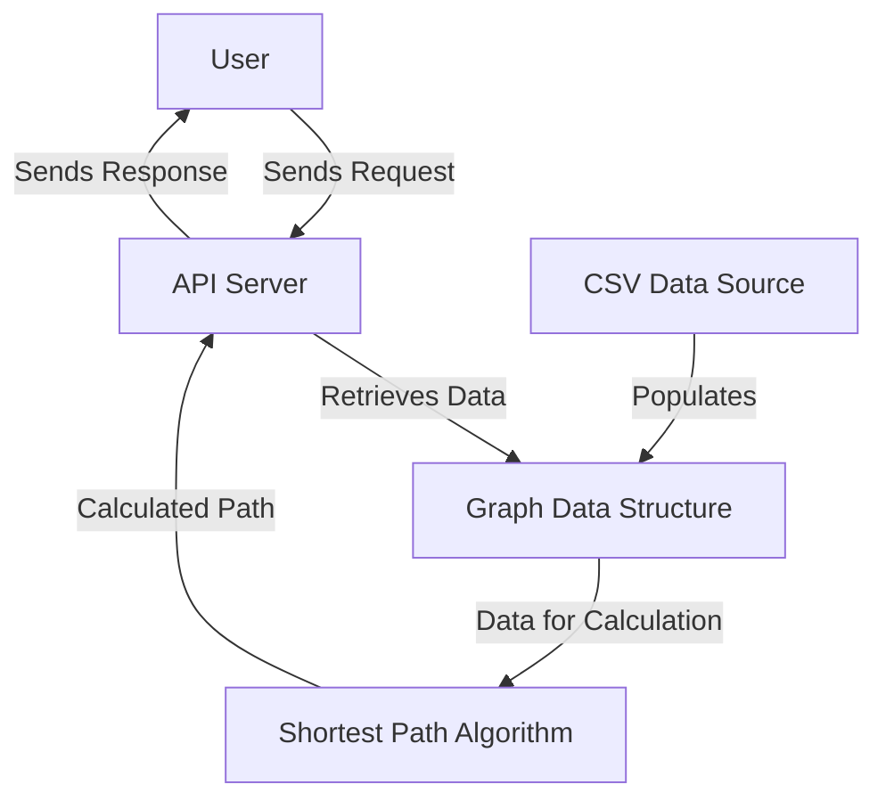

# Technical Specifications Shortest Path Algorithm

<details>
<summary> Table Of Content </summary>

- [Technical Specifications Shortest Path Algorithm](#technical-specifications-shortest-path-algorithm)
  - [Introduction](#introduction)
    - [Project Introduction](#project-introduction)
    - [Document Purpose](#document-purpose)
  - [Technical Requirements](#technical-requirements)
    - [Programming Language](#programming-language)
    - [REST API](#rest-api)
    - [Data Source](#data-source)
    - [Performance Goals](#performance-goals)
    - [Data Integrity Verification](#data-integrity-verification)
    - [Expected Deliverables](#expected-deliverables)
  - [Development Environment](#development-environment)
    - [Programming Language](#programming-language-1)
      - [Why C++?](#why-c)
      - [Compiler Recommendations](#compiler-recommendations)
    - [Development Environment Setup](#development-environment-setup)
      - [Resources](#resources)
    - [File Architecture](#file-architecture)
    - [Dependencies](#dependencies)
      - [STL](#stl)
        - [Usage of STL](#usage-of-stl)
      - [REST API](#rest-api-1)
        - [Boost.Beast](#boostbeast)
          - [Boost.Beast C++ Implementation](#boostbeast-c-implementation)
        - [Localhost](#localhost)
    - [Example of Request/Answer](#example-of-requestanswer)
    - [API Requests and Responses](#api-requests-and-responses)
      - [Successful Request Example](#successful-request-example)
      - [Error Handling Examples](#error-handling-examples)
        - [Example 1: Invalid Landmark ID](#example-1-invalid-landmark-id)
        - [Example 2: Missing Parameters](#example-2-missing-parameters)
        - [Example 3: Not Found](#example-3-not-found)
      - [Common HTTP Status Code](#common-http-status-code)
        - [API Flow](#api-flow)
    - [System Architecture](#system-architecture)
  - [Algorithm](#algorithm)
    - [Algorithm Description](#algorithm-description)
      - [Definition](#definition)
    - [Overview of Bidirectional Dijkstra's Algorithm](#overview-of-bidirectional-dijkstras-algorithm)
      - [How it works](#how-it-works)
      - [Advantages](#advantages)
      - [Pseudocode](#pseudocode)
    - [Data Source](#data-source-1)
    - [Data Integrity Verification](#data-integrity-verification-1)
      - [Functional Specifications](#functional-specifications)
      - [Graph Validation Verification](#graph-validation-verification)
      - [Connectivity Checks](#connectivity-checks)
    - [Data Flow](#data-flow)
    - [Performance](#performance)
      - [Big-O Notation](#big-o-notation)
    - [Data Integrity Verification \& Validation](#data-integrity-verification--validation)
  - [Testing](#testing)
    - [Unit Tests](#unit-tests)
    - [Performance Test](#performance-test)
    - [CI/CD](#cicd)

</details>

## Introduction

### Project Introduction

The objective of this project is to develop a high-performance software solution designed to calculate the shortest travel path between two specified landmarks within the United States. The software will utilize advanced algorithms to efficiently determine the quickest route, considering various travel times between landmarks. Given the scale of the dataset, which includes approximately 24 million nodes, the solution must be optimized for speed, reliability, and scalability.

Such a project is particularly valuable in real-world applications such as logistics, navigation, and urban planning. Efficient route optimization can help businesses reduce fuel consumption, improve delivery times, and enhance overall operational efficiency. Moreover, this software can aid travelers and commuters in making more informed decisions, saving time, and minimizing travel-related uncertainties.

The software will be developed in C++ to fully exploit the language's performance capabilities, particularly for large-scale graph processing. It will expose its functionality through a REST API, allowing external users to query the system for the shortest path between two landmarks. The system will support both JSON and XML formats for API responses, ensuring broad compatibility.

### Document Purpose

This document outlines the code guidelines, technologies, algorithms used, and dependencies required for the project. It provides a clear understanding of the system's architecture, performance goals, and data handling, ensuring consistency and quality in development.

It sets standards for coding practices and collaboration between internal developers and external contributors. For the client, it offers insight into the technical specifications and how the solution meets their needs for calculating the shortest path between landmarks.

## Technical Requirements

### Programming Language

The software must be implemented in C++ to achieve optimal performance.

### REST API

The software exposes its functionality through a Representational State Transfer (REST) application programming interface (API) running on a Hypertext Transfer Protocol (HTTP) localhost server. It includes a single get endpoint with the following features:

- Input: Accept IDs of both the source and destination landmarks.
- Output: Travel time and the ordered list of landmarks in the path.
- Response format must accept both JSON and XML.

### Data Source

The software uses a .csv file named USA-Roads.csv, containing approximately 24 million nodes, each representing a landmark in the USA. Each line is bidirectional, meaning that if a connection exists from A to B, it exists from B to A.

Each line is as follows:

```
Landmark_A_ID,Landmark_B_ID,Time
```

### Performance Goals

The API must handle all queries within 1 second on a typical laptop.

We prioritize speed over precision, meaning we may use heuristics (an approximation of calculus that can be interpreted as "good enough"). However, the returned path should not exceed the shortest path duration by more than 10%.

### Data Integrity Verification

Verify to check whether the graph is a [Directed Acyclic Graph](https://en.wikipedia.org/wiki/Directed_acyclic_graph) free of loops.

Verify that the graph is fully connected and allows navigating between any two landmarks.

Checks can be done using a programming language other than C++, though to stay uniform, we will be doing these checks using C++ as well.

### Expected Deliverables

1. C++ Source Code: Including comments and clear documentation. The code should not use libraries besides STL and what is required for the
Web server.
2. Time and Space Complexity: Big O notation for the main algorithms.
3. REST API Implementation: Demonstrating the ability to handle multiple formats (XML and
JSON).
4. Test Suite: Tests to validate correctness, performance, and compliance with the 10%
approximation rule.
5. Data Validation Tool: A utility to verify the integrity of the provided CSV file.

## Development Environment

### Programming Language

Our team selected C++ as the programming language for this project due to its powerful features and suitability for performance-critical applications.

#### Why C++?

- Performance: Direct memory management and low-level hardware access allow for optimized performance.
- Scalability: Ideal for handling large datasets like the 24 million-node graph in this project.
- Standard Template Library (STL): Provides efficient data structures (e.g., priority queues, maps) critical for shortest path algorithms.
- Portability: Easily deployable across different operating systems with minimal changes.

#### Compiler Recommendations

To ensure compatibility and performance, we recommend the following compilers:

- GCC (GNU Compiler Collection) 9.3 or later
- Clang 10 or later

### Development Environment Setup

To contribute to this project, you need to use an Integrated Development Environment (IDE). If you are unfamiliar with IDEs, we recommend you use Visual Studio Code and install the [C++ extensions pack](https://marketplace.visualstudio.com/items?itemName=ms-vscode.cpptools-extension-pack) to set up your development environment.

#### Resources

For C++'s documentation: [C++ Reference](https://cplusplus.com/reference/)

### File Architecture

```md
2024-2025-project-3-quickest-path-team-4/src
├─── src
│   ├─── boost_1_82_0 
│   │   └─── (all the files necessary for Boost.Beast integrity)
│   ├─── algorithm
│   │   └─── dijksta.cpp
│   │   └─── dijkstra.bin
│   ├─── server
│   │   └─── server.cpp
│   │   └─── server.bin
│   └─── testing
│       
├─── 
└─── 
```

### Dependencies

#### STL

The Standard Template Library (STL) is a powerful library in C++ that provides a collection of ready-to-use classes and functions for common data structures and algorithms. These include dynamic arrays, linked lists, stacks, queues, hash tables, and sorting or searching algorithms. STL helps simplify code, increase efficiency, and maintain consistency.

For this project, where performance and scalability are critical, STL plays a vital role by offering optimized implementations of data structures and algorithms. Below is a breakdown of the selected STL components and how they are used in this project:

##### Usage of STL

Standard Template Library are C++ libraries offering a wide range, which are the data structures used to store objects and data. Here are the most important for this project:

- ```<iostream>```
  - Purpose: Provides input and output functionality for the project.
  - Usage: Used for logging messages, displaying debug information, and handling input/output operations during development and testing.

- ```<string>```
  - Purpose: Provides a robust way to handle strings in C++.
  - Usage: Used to manage API request/response data, handle file paths, and process input/output strings in the program.

- ```<vector>```
  - Purpose: A dynamic array that allows for efficient storage and manipulation of elements.
  - Usage: Represents adjacency lists in graph representations, where each node’s connections are stored in a dynamic array.

- ```<fstream>```
  - Purpose: Provides file input/output functionality.
  - Usage: Reads the .csv file containing graph data, parsing and storing connections for graph construction.

- ```<queue>```
  - Purpose: Implements a FIFO (First-In-First-Out) data structure, including priority queues.
  - Usage: A priority queue is utilized in Dijkstra's algorithm to process nodes based on their shortest path distances.

- ```<unordered_map>```
  - Purpose: Implements a hash table-based associative container for fast key-value pair access.
  - Usage: Maps landmark IDs to their respective neighbors and weights, enabling efficient graph traversal and data retrieval.

- ```<chrono>```
  - Purpose: Provides tools for measuring time intervals and system clocks.
  - Usage: Used to benchmark algorithm performance, ensuring compliance with the <1-second query response goal.

- ```<algorithm>```
  - Purpose: Provides a collection of utility functions for operations like sorting, searching, and manipulating data.
  - Usage: Helps implement sorting or binary search operations required in graph construction and validation.

#### REST API

A REST API (also called a RESTful API or RESTful web API) is an application programming interface (API) that conforms to the design principles of the representational state transfer (REST) architectural style.

REST APIs provide a flexible, lightweight way to integrate applications and connect components in micro-services architectures. Distributed file systems send and receive data via REST.

Rest APIs have to follow 5 principles:

- Uniform interface: All API requests for the same resource should look the same, no matter where the request comes from.

- Client-server decoupling: In REST API design, client and server applications must be completely independent of each other.

- Statelessness: REST APIs are stateless, meaning that each request needs to include all the information necessary for processing it.

- Cacheability: When possible, resources should be cacheable on the client or server side. Server responses also need to contain information about whether caching is allowed for the delivered resource.

- Layered system architecture: In REST APIs, the calls and responses go through different layers. Don’t assume that the client, and server applications connect directly to each other.

For this project, we have to include a single GET endpoint. The endpoint shows where the resource is located. It typically includes a Uniform Resource Identifier (URI). In our case, the URI is located on a local-hosted server.

The sequence diagram below explains how the user, server, and algorithm communicate.


##### Boost.Beast

Boost.Beast is a C++ library that provides low-level HTTP and WebSocket functionality. It allows developers to implement REST APIs by handling HTTP requests and responses efficiently.

We decided to use Boost.Beast as it is tailored to our project, is fast and resilient, Boost.Beast is the backbone of our REST API.

###### Boost.Beast C++ Implementation

To implement and set up Boost.Beast in our project:

1. Download the [the latest Boost.Beast version](https://www.boost.org/users/history/).
2. Extract the files into your project's source folder.
3. Navigate to the extracted folder using your terminal.
4. Execute the command: `tar --bzip2 -xf /path/to/boost_1_82_0.tar.bz2`

Boost.Beast is now installed and initialized in your project's directory.

Here's a sample program to open a local-hosted port 8080:

```c++
#include <boost/beast/core.hpp>
#include <boost/beast/http.hpp>
#include <boost/asio.hpp>
#include <iostream>

namespace beast = boost::beast;
namespace http = beast::http;
namespace net = boost::asio;

int main() {
    try {
        net::io_context ioc;
        net::ip::tcp::acceptor acceptor(ioc, {net::ip::tcp::v4(), 8080});
        net::ip::tcp::socket socket(ioc);

        std::cout << "Server listening on port 8080...\n";

 acceptor.accept(socket);

        beast::flat_buffer buffer;
        http::request<http::string_body> req;
        http::read(socket, buffer, req);

        std::cout << "Received request: " << req << "\n";

        http::response<http::string_body> res{
            http::status::ok, req.version()};
 res.set(http::field::server, "Boost.Beast");
 res.set(http::field::content_type, "text/plain");
 res.body() = "Hello, world!";
 res.prepare_payload();

        http::write(socket, res);
 } catch (const std::exception& e) {
        std::cerr << "Error: " << e.what() << "\n";
 }
}
```

Execute this program using: `g++ -std=c++17 -Iboost_1_82_0  main.cpp -o beast_example -lpthread` \
You can use this starting point to set up the initial server for the project.

##### Localhost

Localhost refers to the local computer where the server is running. By default, the IP address for localhost is 127.0.0.1, and the system can use any open port to handle API requests. In our project, we have configured the server to operate on port 8080. This allows developers to test the REST API locally before deploying it in a production environment.

Purpose of the Project:

- Enables the development and debugging of the REST API without needing external servers.

- Facilitates testing and validation of the algorithm's performance and correctness.

- Ensures secure, isolated testing by restricting external access during development.

**How It Works:**

The Boost.Beast library initializes an HTTP server on the localhost address, we will be using a computer serving as a server during this project, which IP address is 192.168.15.115.

Our client here can send GET requests to the server, this GET request is triggered the first time the algorithm code is run.

It will process the request and respond with the shortest path data in either JSON or XML format.

**Setting up Localhost:**

To set up localhost on port 8080 for this project:

1. Server Initialization:
Use the Boost.Beast library to create an HTTP server.
Bind the server to 192.168.15.115:8080.
2. Handling Requests:
The server listens for incoming GET requests.
It parses the input parameters (source and destination landmark IDs) and passes them to the shortest path algorithm.
The result is formatted into the requested response format (JSON or XML) and sent back to the client.

**Storing Data on the localhost server**

The following code sample shows how to store a file on the server and then how to retrieve it.

```c++
// Function to read the entire file content as a string
std::string read_file(const std::string& file_path) {
    std::ifstream file(file_path);
    if (!file.is_open()) {
        throw std::runtime_error("Failed to open file: " + file_path);
 }

    std::ostringstream ss;
 ss << file.rdbuf();
    return ss.str();
}

// Function to format the file content as a JSON response
std::string to_json(const std::string& file_content) {
    std::string json_response = "{\"file_content\": \"";
 // Escape double quotes in the file content
    std::string escaped_content = file_content;
    std::replace(escaped_content.begin(), escaped_content.end(), '"', '\\');
 json_response += escaped_content;
 json_response += "\"}";
    return json_response;
}

// Function to format the file content as an XML response
std::string to_xml(const std::string& file_content) {
    std::string xml_response = "<?xml version=\"1.0\"?>\n<file>\n";
 xml_response += "<content>";
 xml_response += file_content;
 xml_response += "</content>\n</file>";
    return xml_response;
}

// Function to send the file content as JSON or XML based on the Accept header
void send_response(beast::tcp_stream& stream, const std::string& file_path, http::request<http::string_body>& req) {
 // Read the raw file content
    std::string file_content = read_file(file_path);

 // Prepare the response based on the "Accept" header
    std::string accept = std::string(req[http::field::accept]); // Convert boost::string_view to std::string

    http::response<http::string_body> res;
    if (accept == "application/json") {
        std::string json_data = to_json(file_content);
 res = http::response<http::string_body>(http::status::ok, req.version());
 res.set(http::field::server, "Boost.Beast");
 res.set(http::field::content_type, "application/json");
 res.body() = json_data;
 } else if (accept == "application/xml") {
        std::string xml_data = to_xml(file_content);
 res = http::response<http::string_body>(http::status::ok, req.version());
 res.set(http::field::server, "Boost.Beast");
 res.set(http::field::content_type, "application/xml");
 res.body() = xml_data;
 } else {
 // Default to JSON if no acceptable format is specified
        std::string json_data = to_json(file_content);
 res = http::response<http::string_body>(http::status::ok, req.version());
 res.set(http::field::server, "Boost.Beast");
 res.set(http::field::content_type, "application/json");
 res.body() = json_data;
 }

 res.prepare_payload();
    http::write(stream, res);
}

int main() {
    try {
        const std::string file_path = "USA-roads.csv";

        net::io_context ioc;
        net::ip::tcp::acceptor acceptor(ioc, {net::ip::tcp::v4(), 8080});
 acceptor.set_option(net::socket_base::reuse_address(true));

        std::cout << "Server listening on port 8080...\n";

        while (true) {
 // Create a new socket for each connection
            net::ip::tcp::socket socket(ioc);

 // Accept a connection
 acceptor.accept(socket);

            try {
 // Convert the socket to a tcp_stream
                beast::tcp_stream stream(std::move(socket));

 // Read the request
                beast::flat_buffer buffer;
                http::request<http::string_body> req;
                http::read(stream, buffer, req);

                std::cout << "Received request: " << req << "\n";

 // Send the file content as JSON or XML based on the Accept header
                send_response(stream, file_path, req);
 } catch (const std::exception& e) {
                std::cerr << "Error handling request: " << e.what() << "\n";
 }

 // Ensure the socket is open before calling shutdown
            if (socket.is_open()) {
                beast::error_code ec;
 socket.shutdown(net::ip::tcp::socket::shutdown_send, ec);
                if (ec && ec != beast::errc::not_connected) {
                    std::cerr << "Socket shutdown error: " << ec.message() << "\n";
 }
 }
 }
 } catch (const std::exception& e) {
        std::cerr << "Error: " << e.what() << "\n";
 }
}
```

This snippet above stores the USA-Road.csv file on the server locally, the server then listens for a GET request with a specific header either "application/json" to send a json format, or "application/xml" for an XML format, the user will prompt it to the server.

**Data Retrieval**

To retrieve the data, we can execute the commands:

```bash
curl -H "Accept: application/xml" http://192.168.15.115:8080
```

OR

```
curl -H "Accept: application/json" http://192.168.15.115:8080
```

### Example of Request/Answer

### API Requests and Responses

This section provides examples of how to interact with the REST API, including successful requests and responses, as well as error-handling scenarios.

#### Successful Request Example

**Request:**

To retrieve the shortest path between two landmarks, you can send a GET request to the server with the appropriate headers. Here’s an example using `curl`:

```bash
curl -H "Accept: application/json" "http://192.168.15.115:8080?source=1&destination=10"
```

**Response:**

If the request is successful, the server will respond with a JSON object containing the travel time and the ordered list of landmarks in the path:

```json
{
    "travel_time": 15.5,
    "path": [1, 5, 10]
}
```

#### Error Handling Examples

In case of errors, the server will return appropriate HTTP status codes along with a message detailing the error.

##### Example 1: Invalid Landmark ID

**Request:**

```shell
curl -H "Accept: application/json" "http://192.168.15.115:8080?source=99999&destination=10"
```

**Response:**

```json
{
    "error": "Invalid landmark ID: 99999"
}
```

**HTTP Status Code: 400 Bad Request**

---

##### Example 2: Missing Parameters

**Request:**

```shell
curl -H "Accept: application/json" "http://192.168.15.115:8080"
```

**Response:**

```json
{
    "error": "Missing required parameters: source and destination"
}
```

**HTTP Status Code: 400 Bad Request**

---

##### Example 3: Not Found

**Request:**

```shell
curl -H "Accept: application/json" "http://192.168.15.115:8080?source=1&destination=99999"
```

**Response:**

```json
{
    "error": "No path found between landmarks 1 and 99999"
}
```

**HTTP Status Code: 404 Not Found**

#### Common HTTP Status Code

| HTTP Status Code | Meaning                                      |
|------------------|----------------------------------------------|
| 200              | OK - The request was successful.            |
| 400              | Bad Request - The server could not understand the request due to invalid syntax. |
| 404              | Not Found - The requested resource could not be found. |
| 500              | Internal Server Error - The server encountered an unexpected condition. |

##### API Flow



| Element                     | Description                                                                 |
|-----------------------------|-----------------------------------------------------------------------------|
| User                    | Represents the end-user who interacts with the API.                        |
| API Server              | The server that processes requests and sends responses.                    |
| Graph Data Structure    | The data structure that holds the graph representation of landmarks and connections. |
| Shortest Path Algorithm | The algorithm used to calculate the shortest path between landmarks.       |
| CSV Data Source         | The source of the data used to populate the graph.                         |

### System Architecture

## Algorithm

### Algorithm Description

For this project, we have chosen to implement a bidirectional Dijkstra's algorithm as our primary method for calculating the shortest path between landmarks. This variant of Dijkstra's algorithm is a well-established approach used for finding the shortest paths from a source node to a target node in a weighted graph. It operates by simultaneously exploring the graph from both the source and the target nodes, effectively reducing the search space and improving efficiency.

The bidirectional Dijkstra's algorithm works by maintaining two sets of distances: one from the source node and another from the target node. Each search proceeds until the two searches meet, at which point the shortest path can be determined. This method is particularly advantageous in large graphs, as it can significantly decrease the time complexity compared to a unidirectional search.

We opted against using the A*(A star) algorithm due to the absence of a suitable heuristic for our specific use case. The A* algorithm typically relies on a heuristic function to estimate the cost from a given node to the target node, which helps guide the search process. However, in our scenario, we lack spatial coordinates or specific destination points; instead, we only have the travel times between landmarks. This limitation renders the creation of an effective heuristic impractical, as the time-based weights do not provide a meaningful estimate of distance or cost in the context of our graph.

The bidirectional Dijkstra's algorithm, on the other hand, is well-suited for our needs as it does not require heuristics and can efficiently handle graphs with non-negative weights. By leveraging this algorithm, we can ensure accurate and reliable calculations of the shortest paths based solely on the travel times provided in our dataset.

[Dijkstra's gif](./image/technicalSpecifications/Dijkstra_Animation.gif)

#### Definition

These terms are crucial for the subsequent section. Kindly refer to the table below to ensure a comprehensive understanding of the material that follows.

| Term            | Definition                                                                                     |
|------------------|------------------------------------------------------------------------------------------------|
| **Nodes**        | The fundamental units in a graph that represent entities or points. In the context of a graph, nodes are often referred to as vertices. |
| **Weighted Graph** | A graph in which each edge has an associated numerical value (weight) that represents the cost, distance, or time to traverse that edge. |
| **Heuristic**    | A problem-solving approach that employs a practical method or various shortcuts to produce solutions that may not be optimal but are sufficient for reaching an immediate goal. In pathfinding, heuristics help estimate the cost to reach the goal from a given node. |
| **Edges**        | The connections between nodes in a graph. Edges can be directed (one-way) or undirected (two-way) and may have weights in a weighted graph. |
| **Priority Queue** | A data structure that stores elements in such a way that the element with the highest priority is served before other elements with lower priority. In the context of graph algorithms, it is often used to efficiently retrieve the next node to process based on the shortest distance or lowest cost. |

### Overview of Bidirectional Dijkstra's Algorithm

Bidirectional Dijkstra's algorithm simultaneously searches from both the source node and the target node. By doing so, it effectively reduces the number of nodes that need to be explored, as the search can meet in the middle. This approach is particularly useful in large graphs where the distance between the source and target nodes is significant.

#### How it works

1. Initialization:
   - Two sets of distances are maintained: one for the forward search (from the source) and one for the backward search (from the target).
   - Two priority queues are used to manage the nodes being explored in both directions.

2. Forward Search:
   - Starting from the source node, the algorithm explores neighboring nodes and updates their distances based on the weights of the edges.
   - Each time a node is processed, it is added to the forward priority queue.

3. Backward Search:
   - Simultaneously, the algorithm starts from the target node and explores its neighbors, updating distances in the backward direction.
   - Nodes are added to the backward priority queue as they are processed.

4. Meeting Point:
   - The algorithm continues to expand both searches until the two searches meet at a common node.
   - When a node is found that has been processed by both the forward and backward searches, the algorithm can determine the shortest path by combining the distances from both searches.

5. Path Reconstruction:
   - Once the meeting point is identified, the shortest path can be reconstructed by tracing back from the meeting point to the source and from the meeting point to the target.

#### Advantages

- Efficiency: By searching from both ends, the algorithm can significantly reduce the number of nodes explored, leading to faster execution times, especially in large graphs.
- Reduced Memory Usage: Since fewer nodes are stored in memory at any given time compared to a unidirectional search, it can be more memory-efficient.

#### Pseudocode

Below is the pseudocode representation of the Dijkstra's algorithm:

```c++
function BidirectionalDijkstra(graph, source, target):
    // Initialize distances and priority queues
    distFromSource = array of size |V| initialized to infinity
    distFromTarget = array of size |V| initialized to infinity
    distFromSource[source] = 0
    distFromTarget[target] = 0

    forwardQueue = empty priority queue
    backwardQueue = empty priority queue
    forwardQueue.push((0, source)) // (distance, vertex)
    backwardQueue.push((0, target)) // (distance, vertex)

    while forwardQueue is not empty and backwardQueue is not empty:
        // Expand the forward search
        (currentDistance, currentVertex) = forwardQueue.pop()
        if currentDistance > distFromSource[currentVertex]:
            continue
        // Process neighbors
        for each neighbor in graph[currentVertex]:
            distance = currentDistance + weight(currentVertex, neighbor)
            if distance < distFromSource[neighbor]:
                distFromSource[neighbor] = distance
                forwardQueue.push((distance, neighbor))

        // Expand the backward search
        (currentDistance, currentVertex) = backwardQueue.pop()
        if currentDistance > distFromTarget[currentVertex]:
            continue
        // Process neighbors
        for each neighbor in graph[currentVertex]:
            distance = currentDistance + weight(currentVertex, neighbor)
            if distance < distFromTarget[neighbor]:
                distFromTarget[neighbor] = distance
                backwardQueue.push((distance, neighbor))

        // Check for meeting point
        if a common node is found in both searches:
            return combine distances to find the shortest path

    return "No path found"
```

### Data Source

The client provided the dataset as a `.csv` file containing approximately 24 million nodes. Each row in the file represents a connection between two landmarks and is formatted as follows: \
`Landmark_A_ID,Landmark_B_ID,Time`

Here:

- Landmark_A_ID and Landmark_B_ID are unique identifiers for landmarks.
- Time represents the travel time between the two landmarks in an unspecified unit, time being a unit of time itself.

These connections can be visualized as edges in a graph, where landmarks serve as nodes, and the Time represents the edge weights.

To use this data effectively:

1. We parse the .csv file, separating the elements by the comma delimiter.
2. Each row is then processed to extract the source (Landmark_A_ID), destination (Landmark_B_ID), and weight (Time).
3. Finally, the data is stored in an adjacency matrix, for efficient graph traversal during algorithm execution.

Below is the improved explanation along with pseudocode to parse the data:

```pseudocode
function parseCSV(file_path):
 graph = empty adjacency_matrix[]

 open file at file_path
 for each line in the file:
 data = split(line, ",")
 landmark_A = int(data[0])
 landmark_B = int(data[1])
 time = float(data[2])

 if landmark_A not in graph:
 graph[landmark_A] = empty list()
 if landmark_B not in graph:
 graph[landmark_B] = empty list()

 graph[landmark_A].append((landmark_B, time))
 graph[landmark_B].append((landmark_A, time))  # if the graph is undirected

 close file
 return graph
```

### Data Integrity Verification

#### Functional Specifications

#### Graph Validation Verification

#### Connectivity Checks

### Data Flow

How data moves through the system from input to processing and output.


### Performance

#### Big-O Notation

O((V+E)⋅logV)
where 𝑉
V is the number of nodes

𝐸
E is the number of edges.

### Data Integrity Verification & Validation

## Testing

### Unit Tests

### Performance Test

### CI/CD
