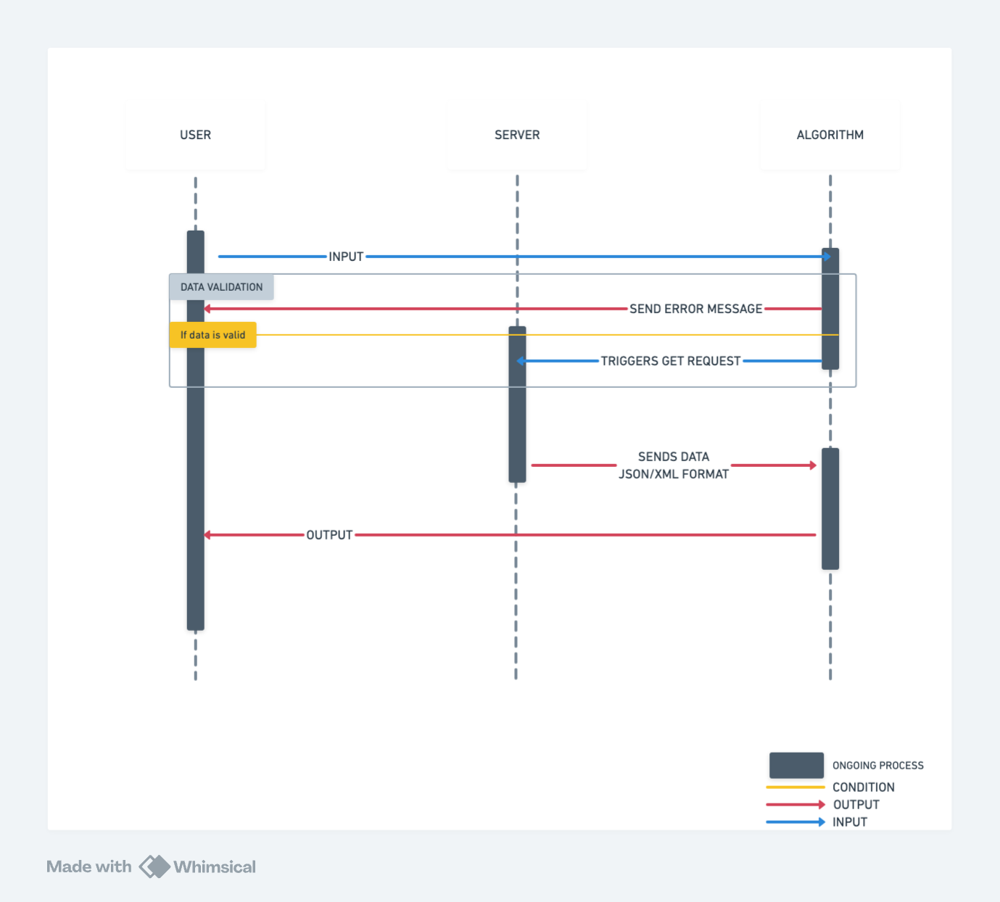
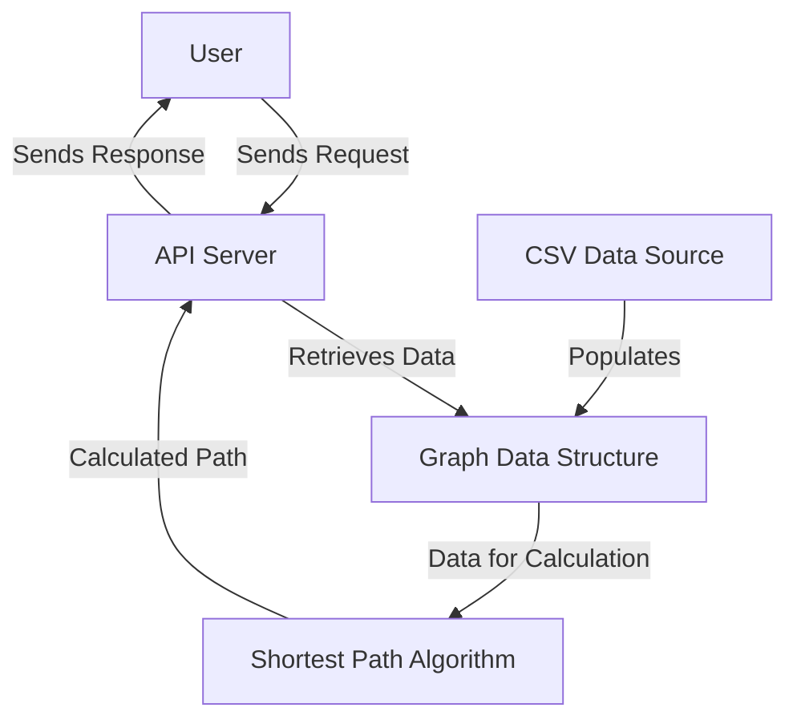
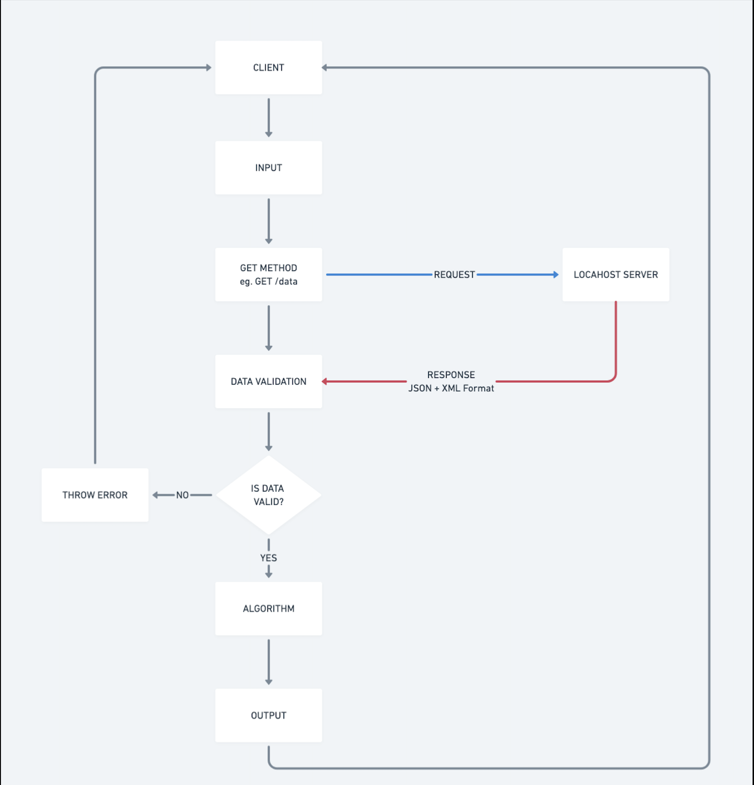

# Technical Specifications Shortest Path Algorithm

<details>
<summary> Table Of Content </summary>

- [Technical Specifications Shortest Path Algorithm](#technical-specifications-shortest-path-algorithm)
  - [Introduction](#introduction)
    - [Project Introduction](#project-introduction)
    - [Document Purpose](#document-purpose)
  - [Technical Requirements](#technical-requirements)
    - [Programming Language](#programming-language)
    - [REST API](#rest-api)
    - [Data Source](#data-source)
    - [Performance Goals](#performance-goals)
    - [Data Integrity Verification](#data-integrity-verification)
    - [Expected Deliverables](#expected-deliverables)
  - [Development Environment](#development-environment)
    - [Programming Language](#programming-language-1)
      - [Why C++?](#why-c)
      - [Compiler Recommendations](#compiler-recommendations)
    - [Development Environment Setup](#development-environment-setup)
      - [Resources](#resources)
    - [File Architecture](#file-architecture)
    - [Dependencies](#dependencies)
      - [STL](#stl)
        - [Usage of STL](#usage-of-stl)
      - [Git Large File Storage](#git-large-file-storage)
      - [REST API](#rest-api-1)
        - [Boost.Beast](#boostbeast)
          - [Boost.Beast C++ Implementation](#boostbeast-c-implementation)
        - [Localhost](#localhost)
    - [Example of Request/Answer](#example-of-requestanswer)
    - [API Requests and Responses](#api-requests-and-responses)
      - [Successful Request Example](#successful-request-example)
      - [Error Handling Examples](#error-handling-examples)
        - [Example 1: Invalid Landmark ID](#example-1-invalid-landmark-id)
        - [Example 2: Missing Parameters](#example-2-missing-parameters)
        - [Example 3: Not Found](#example-3-not-found)
      - [Common HTTP Status Code](#common-http-status-code)
        - [API Flow](#api-flow)
    - [System Architecture](#system-architecture)
  - [Algorithm](#algorithm)
    - [Algorithm Description](#algorithm-description)
      - [Definition](#definition)
    - [Overview of Bidirectional Dijkstra's Algorithm](#overview-of-bidirectional-dijkstras-algorithm)
      - [How it works](#how-it-works)
      - [Advantages](#advantages)
      - [Multi-Threading](#multi-threading)
      - [Pseudocode](#pseudocode)
    - [Data Source](#data-source-1)
    - [Data Integrity Verification](#data-integrity-verification-1)
      - [Functional Specifications](#functional-specifications)
      - [Breadth-First Search](#breadth-first-search)
        - [Why do we use BFS?](#why-do-we-use-bfs)
      - [Graph Validation Verification](#graph-validation-verification)
      - [Connectivity Checks](#connectivity-checks)
    - [Data Flow](#data-flow)
    - [Performance](#performance)
      - [Optimization](#optimization)
      - [Big-O Notation](#big-o-notation)
        - [Time Complexity](#time-complexity)
        - [What Does This Time Complexity Mean?](#what-does-this-time-complexity-mean)
        - [Space complexity](#space-complexity)
          - [Space Complexity Calculation for Bidirectional Dijkstra's Algorithm](#space-complexity-calculation-for-bidirectional-dijkstras-algorithm)
          - [Total Space Complexity](#total-space-complexity)
  - [Testing](#testing)
    - [Unit Tests](#unit-tests)
    - [Performance Test](#performance-test)
    - [CI/CD](#cicd)
  - [Conclusion](#conclusion)
  - [Glossary](#glossary)

</details>

## Introduction

### Project Introduction

The objective of this project is to develop a high-performance software solution designed to calculate the shortest travel path between two specified landmarks within the United States. The software will utilize advanced algorithms to efficiently determine the quickest route by considering various travel times between landmarks. Given the scale of the dataset, which includes approximately 24 million nodes, the solution must be optimized for speed, reliability, and scalability.

Such a project is particularly valuable in real-world applications such as logistics, navigation, and urban planning. Efficient route optimization can help businesses reduce fuel consumption, improve delivery times, and enhance overall operational efficiency. Moreover, this software can aid travelers and commuters in making more informed decisions, saving time, and minimizing travel-related uncertainties.

The software will be developed in C++ to fully exploit the language's performance capabilities, particularly for large-scale graph processing. It will expose its functionality through a REST API, allowing external users to query the system for the shortest path between two landmarks. The system will support both JSON and XML formats for API responses, ensuring broad compatibility.

### Document Purpose

This document outlines the code guidelines, technologies, algorithms used, and dependencies required for the project. It provides a clear understanding of the system's architecture, performance goals, and data handling, ensuring consistency and quality in development.

It sets standards for coding practices and collaboration between internal developers and external contributors. For the client, it offers insight into the technical specifications and how the solution meets their needs for calculating the shortest path between landmarks.

## Technical Requirements

### Programming Language

The software must be implemented in C++ to achieve optimal performance.

### REST API

The software exposes its functionality through a Representational State Transfer (REST) application programming interface (API) running on a Hypertext Transfer Protocol (HTTP) localhost server. It includes a single get endpoint with the following features:

- Input: Accept IDs of both the source and destination landmarks.
- Output: Travel time and the ordered list of landmarks in the path.
- Response format must accept both JSON and XML.

### Data Source

The software uses a .csv file named USA-Roads.csv, containing approximately 24 million nodes, each representing a landmark in the USA. Each line is bidirectional, meaning that if a connection exists from A to B, it exists from B to A.

Each line is as follows:

```
Landmark_A_ID,Landmark_B_ID,Time
```

### Performance Goals

The API must handle all queries within 1 second on a typical laptop.

We prioritize speed over precision, meaning we may use heuristics (an approximation of calculus that can be interpreted as "good enough"). However, the returned path should not exceed the shortest path duration by more than 10%.

### Data Integrity Verification

Verify whether the graph is a [Directed Acyclic Graph](https://en.wikipedia.org/wiki/Directed_acyclic_graph) that is free of loops.

Verify that the graph is fully connected and allows navigating between two landmarks.

Checks can be performed using a programming language other than C++, though we will use C++ as well to stay uniform.

### Expected Deliverables

1. C++ Source Code: This should include comments and clear documentation. The code should only use libraries from the STL and those required for the web server.
2. Time and Space Complexity: Big O notation for the main algorithms.
3. REST API Implementation: Demonstrating the ability to handle multiple formats (XML and
 JSON).
4. Test Suite: Tests to validate correctness, performance, and compliance with the 10%
 approximation rule.
5. Data Validation Tool: A utility to verify the integrity of the provided CSV file.

## Development Environment

### Programming Language

Our team selected C++ as the programming language for this project due to its powerful features and suitability for performance-critical applications.

#### Why C++?

- Performance: Direct memory management and low-level hardware access allow for optimized performance.
- Scalability: Ideal for handling large datasets like the 24 million-node graph in this project.
- Standard Template Library (STL): This library provides efficient data structures (e.g., priority queues and maps) critical for shortest path algorithms.
- Portability: Easily deployable across different operating systems with minimal changes.

#### Compiler Recommendations

To ensure compatibility and performance, we recommend the following compilers:

- GCC (GNU Compiler Collection) 9.3 or later
- Clang 10 or later

### Development Environment Setup

To contribute to this project, you need to use an Integrated Development Environment (IDE). If you are unfamiliar with IDEs, we recommend you use Visual Studio Code and install the [C++ extensions pack](https://marketplace.visualstudio.com/items?itemName=ms-vscode.cpptools-extension-pack) to set up your development environment.

#### Resources

For C++'s documentation: [C++ Reference](https://cplusplus.com/reference/)

### File Architecture

```
2024-2025-project-3-quickest-path-team-4/src
├─── src
│   ├─── boost_1_82_0 
│   │   └─── (all the files necessary for Boost.Beast integrity)
│   ├─── algorithm
│   │   └─── dijksta.cpp
│   │   └─── dijkstra.bin
│   ├─── server
│   │   └─── server.cpp
│   │   └─── server.bin
│   └─── testing
│   
├─── 
└─── 
```

### Dependencies

#### STL

The Standard Template Library (STL) is a powerful C++ library that provides a collection of ready-to-use classes and functions for common data structures and algorithms. These include dynamic arrays, linked lists, stacks, queues, hash tables, and sorting or searching algorithms. STL helps simplify code, increase efficiency, and maintain consistency.

For this project, where performance and scalability are critical, STL plays a vital role by offering optimized implementations of data structures and algorithms. Below is a breakdown of the selected STL components and how they are used in this project:

##### Usage of STL

Standard Template Library is a C++ library offering a wide range of data structures used to store objects and data. Here are the most important for this project:

- ``<iostream>``

- Purpose: Provides input and output functionality for the project.
- Usage: Used for logging messages, displaying debug information, and handling input/output operations during development and testing.
- ``<string>``

- Purpose: Provides a robust way to handle strings in C++.
- Usage: Used to manage API request/response data, handle file paths, and process input/output strings in the program.
- ``<vector>``

- Purpose: A dynamic array that allows for efficient storage and manipulation of elements.
- Usage: Represents adjacency lists in graph representations, where each node’s connections are stored in a dynamic array.
- ``<fstream>``

- Purpose: Provides file input/output functionality.
- Usage: Reads the .csv file containing graph data, parsing and storing connections for graph construction.
- ``<queue>``

- Purpose: Implements a FIFO (First-In-First-Out) data structure, including priority queues.
 Usage: Dijkstra's algorithm uses a priority queue to process nodes based on their shortest path distances.
- ``<unordered_map>``

- Purpose: Implements a hash table-based associative container for fast key-value pair access.
- Usage: Maps landmark IDs to their respective neighbors and weights, enabling efficient graph traversal and data retrieval.
- ``<chrono>``

- Purpose: Provides tools for measuring time intervals and system clocks.
- Usage: Used to benchmark algorithm performance, ensuring compliance with the <1-second query response goal.
- ``<algorithm>``

- Purpose: Provides a collection of utility functions for operations like sorting, searching, and manipulating data.
- Usage: Helps implement sorting or binary search operations required in graph construction and validation.

#### Git Large File Storage

Git Large File Storage (Git LFS) is an extension for Git that enables users to manage large files more efficiently. Instead of storing large files directly in the Git repository, Git LFS replaces them with lightweight references, while the actual file content is stored on a remote server. This approach helps to:

- Reduce the size of the repository.
- Improve performance.
- Streamline the process of versioning large assets, such as datasets, without impacting the overall speed of Git operations.

The `Data-Roads.csv` file is stored using Git LFS due to GitHub's limitation of 100 MB for individual file sizes, while the initial size of the dataset is approximately 653 MB. To effectively use Git LFS for this file, follow these steps:

1. **Install Git LFS**:
   - Follow the installation instructions provided in the [Git LFS download guide](https://docs.github.com/en/repositories/working-with-files/managing-large-files/installing-git-large-file-storage?platform=mac).

2. **Navigate to the Directory**:
   - Open your terminal and change to the directory where the `Data-Roads.csv` file is located.

3. **Fetch the Large Files**:
   - Run the command:

 ```bash
     git lfs fetch
 ```

4. **Pull the Large Files**:
   - Execute the following command to download the actual file content:

 ```bash
     git lfs pull
 ```

If you attempt to access the `Data-Roads.csv` file without pulling the data from Git LFS, for example, by executing a GET HTTP request like:

```bash
curl http://192.168.15.115:8080
```

You will receive a response similar to the following:

```bash
version https://git-lfs.github.com/spec/v1
oid sha256:5b60e8cb900ec11cce3dd1a6547d0ab499aadf8198f2f0bb5abb87633369adc0
size 668512325
```

This output indicates that the GET request only returns a pointer to the file's location rather than the actual file data itself. \
To access the content of Data-Roads.csv, it is essential to perform the git lfs pull command, which retrieves the file from the remote storage. By utilizing Git LFS, you can efficiently manage large files in the Git repository, ensuring that your version control system remains responsive and performant.

#### REST API

A REST API (also called a RESTful API or RESTful web API) is an application programming interface (API) that conforms to the design principles of the representational state transfer (REST) architectural style.

REST APIs provide a flexible, lightweight way to integrate applications and connect components in micro-services architectures. Distributed file systems send and receive data via REST.

Rest APIs have to follow 5 principles:

- Uniform interface: All API requests for the same resource should look the same, no matter where the request comes from.
- Client-server decoupling: In REST API design, client and server applications must be completely independent of each other.
- Statelessness: REST APIs are stateless, meaning that each request needs to include all the information necessary for processing it.
- Cacheability: When possible, resources should be cacheable on the client or server side. Server responses also need to contain information about whether caching is allowed for the delivered resource.
- Layered system architecture: In REST APIs, the calls and responses go through different layers. Don’t assume that the client, and server applications connect directly to each other.

For this project, we have to include a single GET endpoint. The endpoint shows where the resource is located. It typically includes a Uniform Resource Identifier (URI). In our case, the URI is located on a local-hosted server.

The sequence diagram below explains how the user, server, and algorithm communicate.


##### Boost.Beast

Boost.Beast is a C++ library that provides low-level HTTP and WebSocket functionality. It allows developers to implement REST APIs by handling HTTP requests and responses efficiently.

We decided to use Boost.Beast as it is tailored to our project, is fast and resilient, Boost.Beast is the backbone of our REST API.

###### Boost.Beast C++ Implementation

To implement and set up Boost.Beast in our project:

1. Download the [the latest Boost.Beast version](https://www.boost.org/users/history/).
2. Extract the files into your project's source folder.
3. Navigate to the extracted folder using your terminal.
4. Execute the command: `tar --bzip2 -xf /path/to/boost_1_82_0.tar.bz2`

Boost.Beast is now installed and initialized in your project's directory.

Here's a sample program to open a local-hosted port 8080:

```c++
#include <boost/beast/core.hpp>
#include <boost/beast/http.hpp>
#include <boost/asio.hpp>
#include <iostream>

namespace beast = boost::beast;
namespace http = beast::http;
namespace net = boost::asio;

int main() {
 try {
 net::io_context ioc;
 net::ip::tcp::acceptor acceptor(ioc, {net::ip::tcp::v4(), 8080});
 net::ip::tcp::socket socket(ioc);

 std::cout << "Server listening on port 8080...\n";

 acceptor.accept(socket);

 beast::flat_buffer buffer;
 http::request<http::string_body> req;
 http::read(socket, buffer, req);

 std::cout << "Received request: " << req << "\n";

 http::response<http::string_body> res{
 http::status::ok, req.version()};
 res.set(http::field::server, "Boost.Beast");
 res.set(http::field::content_type, "text/plain");
 res.body() = "Hello, world!";
 res.prepare_payload();

 http::write(socket, res);
 } catch (const std::exception& e) {
 std::cerr << "Error: " << e.what() << "\n";
 }
}
```

Execute this program using: `g++ -std=c++17 -Iboost_1_82_0  main.cpp -o beast_example -lpthread`
You can use this starting point to set up the project's initial server.

##### Localhost

Localhost refers to the local computer where the server is running. By default, the IP address for localhost is 127.0.0.1, and the system can use any open port to handle API requests. In our project, we have configured the server to operate on port 8080. This allows developers to test the REST API locally before deploying it in a production environment.

Purpose of the Project:

- Enables the development and debugging of the REST API without needing external servers.
- Facilitates testing and validation of the algorithm's performance and correctness.
- Ensures secure, isolated testing by restricting external access during development.

**How It Works:**

The Boost.Beast library initializes an HTTP server on the localhost address, we will be using a computer serving as a server during this project, which IP address is 192.168.15.115.

Our client here can send GET requests to the server, this GET request is triggered the first time the algorithm code is run.

It will process the request and respond with the shortest path data in either JSON or XML format.

**Setting up Localhost:**

To set up localhost on port 8080 for this project:

1. Server Initialization:
 Use the Boost.Beast library to create an HTTP server.
 Bind the server to 192.168.15.115:8080.
2. Handling Requests:
 The server listens for incoming GET requests.
 It parses the input parameters (source and destination landmark IDs) and passes them to the shortest path algorithm.
 The result is formatted into the requested response format (JSON or XML) and sent back to the client.

**Storing Data on the localhost server**

The following code sample shows how to store a file on the server and then how to retrieve it.

```c++
// Function to read the entire file content as a string
std::string read_file(const std::string& file_path) {
 std::ifstream file(file_path);
 if (!file.is_open()) {
 throw std::runtime_error("Failed to open file: " + file_path);
 }

 std::ostringstream ss;
 ss << file.rdbuf();
 return ss.str();
}

// Function to format the file content as a JSON response
std::string to_json(const std::string& file_content) {
 std::string json_response = "{\"file_content\": \"";
 // Escape double quotes in the file content
 std::string escaped_content = file_content;
 std::replace(escaped_content.begin(), escaped_content.end(), '"', '\\');
 json_response += escaped_content;
 json_response += "\"}";
 return json_response;
}

// Function to format the file content as an XML response
std::string to_xml(const std::string& file_content) {
 std::string xml_response = "<?xml version=\"1.0\"?>\n<file>\n";
 xml_response += "<content>";
 xml_response += file_content;
 xml_response += "</content>\n</file>";
 return xml_response;
}

// Function to send the file content as JSON or XML based on the Accept header
void send_response(beast::tcp_stream& stream, const std::string& file_path, http::request<http::string_body>& req) {
 // Read the raw file content
 std::string file_content = read_file(file_path);

 // Prepare the response based on the "Accept" header
 std::string accept = std::string(req[http::field::accept]); // Convert boost::string_view to std::string

 http::response<http::string_body> res;
 if (accept == "application/json") {
 std::string json_data = to_json(file_content);
 res = http::response<http::string_body>(http::status::ok, req.version());
 res.set(http::field::server, "Boost.Beast");
 res.set(http::field::content_type, "application/json");
 res.body() = json_data;
 } else if (accept == "application/xml") {
 std::string xml_data = to_xml(file_content);
 res = http::response<http::string_body>(http::status::ok, req.version());
 res.set(http::field::server, "Boost.Beast");
 res.set(http::field::content_type, "application/xml");
 res.body() = xml_data;
 } else {
 // Default to JSON if no acceptable format is specified
 std::string json_data = to_json(file_content);
 res = http::response<http::string_body>(http::status::ok, req.version());
 res.set(http::field::server, "Boost.Beast");
 res.set(http::field::content_type, "application/json");
 res.body() = json_data;
 }

 res.prepare_payload();
 http::write(stream, res);
}

int main() {
 try {
 const std::string file_path = "USA-roads.csv";

 net::io_context ioc;
 net::ip::tcp::acceptor acceptor(ioc, {net::ip::tcp::v4(), 8080});
 acceptor.set_option(net::socket_base::reuse_address(true));

 std::cout << "Server listening on port 8080...\n";

 while (true) {
 // Create a new socket for each connection
 net::ip::tcp::socket socket(ioc);

 // Accept a connection
 acceptor.accept(socket);

 try {
 // Convert the socket to a tcp_stream
 beast::tcp_stream stream(std::move(socket));

 // Read the request
 beast::flat_buffer buffer;
 http::request<http::string_body> req;
 http::read(stream, buffer, req);

 std::cout << "Received request: " << req << "\n";

 // Send the file content as JSON or XML based on the Accept header
 send_response(stream, file_path, req);
 } catch (const std::exception& e) {
 std::cerr << "Error handling request: " << e.what() << "\n";
 }

 // Ensure the socket is open before calling shutdown
 if (socket.is_open()) {
 beast::error_code ec;
 socket.shutdown(net::ip::tcp::socket::shutdown_send, ec);
 if (ec && ec != beast::errc::not_connected) {
 std::cerr << "Socket shutdown error: " << ec.message() << "\n";
 }
 }
 }
 } catch (const std::exception& e) {
 std::cerr << "Error: " << e.what() << "\n";
 }
}
```

This snippet above stores the USA-Road.csv file on the server locally, the server then listens for a GET request with a specific header either "application/json" to send a json format, or "application/xml" for an XML format, the user will prompt it to the server.

**Data Retrieval**

To retrieve the data, we can execute the commands:

```bash
curl -H "Accept: application/xml" http://192.168.15.115:8080
```

OR

```bash
curl -H "Accept: application/json" http://192.168.15.115:8080
```

### Example of Request/Answer

### API Requests and Responses

This section provides examples of how to interact with the REST API, including successful requests and responses, as well as error handling scenarios.

#### Successful Request Example

**Request:**

To retrieve the shortest path between two landmarks, you can send a GET request to the server with the appropriate headers. Here’s an example using `curl`:

```bash
curl -H "Accept: application/json" "http://192.168.15.115:8080?source=1&destination=10"
```

**Response:**

If the request is successful, the server will respond with a JSON object containing the travel time and the ordered list of landmarks in the path:

```json
{
    "travel_time": 15.5,
    "path": [1, 5, 10]
}
```

#### Error Handling Examples

In case of errors, the server will return appropriate HTTP status codes along with a message detailing the error.

##### Example 1: Invalid Landmark ID

**Request:**

```bash
curl -H "Accept: application/json" "http://192.168.15.115:8080?source=99999&destination=10"
```

**Response:**

```json
{
    "error": "Invalid landmark ID: 99999"
}
```

**HTTP Status Code: 400 Bad Request**

---

##### Example 2: Missing Parameters

**Request:**

```bash
curl -H "Accept: application/json" "http://192.168.15.115:8080"
```

**Response:**

```json
{
    "error": "Missing required parameters: source and destination"
}
```

**HTTP Status Code: 400 Bad Request**

---

##### Example 3: Not Found

**Request:**

```bash
curl -H "Accept: application/json" "http://192.168.15.115:8080?source=1&destination=99999"
```

**Response:**

```json
{
    "error": "No path found between landmarks 1 and 99999"
}
```

**HTTP Status Code: 404 Not Found**

#### Common HTTP Status Code

| HTTP Status Code | Meaning                                                                          |
| ---------------- | -------------------------------------------------------------------------------- |
| 200              | OK - The request was successful.                                                 |
| 400              | Bad Request - The server could not understand the request due to invalid syntax. |
| 404              | Not Found - The requested resource could not be found.                           |
| 500              | Internal Server Error - The server encountered an unexpected condition.          |

##### API Flow



| Element                 | Description                                                                          |
| ----------------------- | ------------------------------------------------------------------------------------ |
| User                    | Represents the end-user who interacts with the API.                                  |
| API Server              | The server that processes requests and sends responses.                              |
| Graph Data Structure    | The data structure that holds the graph representation of landmarks and connections. |
| Shortest Path Algorithm | The algorithm is used to calculate the shortest path between landmarks.                 |
| CSV Data Source         | The source of the data used to populate the graph.                                   |

### System Architecture

## Algorithm

### Algorithm Description

For this project, we have chosen to implement a bidirectional Dijkstra algorithm as our primary method for calculating the shortest path between landmarks. This variant of Dijkstra's algorithm is a well-established approach used for finding the shortest paths from a source node to a target node in a weighted graph. It operates by simultaneously exploring the graph from both the source and the target nodes, effectively reducing the search space and improving efficiency.

The bidirectional Dijkstra's algorithm works by maintaining two sets of distances: one from the source node and another from the target node. Each search proceeds until the two searches meet, at which point the shortest path can be determined. This method is particularly advantageous in large graphs, as it can significantly decrease the time complexity compared to a unidirectional search.

We opted against using the A*(A star) algorithm due to the absence of a suitable heuristic for our specific use case. The A* algorithm typically relies on a heuristic function to estimate the cost from a given node to the target node, which helps guide the search process. However, in our scenario, we lack spatial coordinates or specific destination points; instead, we only have the travel times between landmarks. This limitation renders the creation of an effective heuristic impractical, as the time-based weights do not provide a meaningful estimate of distance or cost in the context of our graph.

The bidirectional Dijkstra's algorithm, on the other hand, is well-suited for our needs as it does not require heuristics and can efficiently handle graphs with non-negative weights. By leveraging this algorithm, we can ensure accurate and reliable calculations of the shortest paths based solely on the travel times provided in our dataset.

Below, you can find a nicely made YouTube video that shows the speed difference between the original Dijkstra's algorithm and the bidirectional one when it comes to calculating the distance from point A to B using the US road network:

[Dijkstra vs Bi-directional Dijkstra Algorithm on US Road Network](https://youtu.be/1oVuQsxkhY0?si=m3aMwhhYETNz2u8m)

#### Definition

These terms are crucial for the subsequent section. Kindly refer to the table below to ensure a comprehensive understanding of the material that follows.

| Term                     | Definition                                                                                                                                                                                                                                                                                               |
| ------------------------ | -------------------------------------------------------------------------------------------------------------------------------------------------------------------------------------------------------------------------------------------------------------------------------------------------------- |
| **Nodes** | The fundamental units in a graph that represent entities or points. In the context of a graph, nodes are often referred to as vertices.                                                                                                                                                                  |
| **Weighted Graph** | A graph in which each edge has an associated numerical value (weight) that represents the cost, distance, or time to traverse that edge.                                                                                                                                                                 |
| **Heuristic** | A problem-solving approach that employs a practical method or various shortcuts to produce solutions that may not be optimal but are sufficient for reaching an immediate goal. In pathfinding, heuristics help estimate the cost to reach the goal from a given node.                                   |
| **Edges** | The connections between nodes in a graph. Edges can be directed (one-way) or undirected (two-way) and may have weights in a weighted graph.                                                                                                                                                              |
| **Priority Queue** | A data structure that stores elements in such a way that the element with the highest priority is served before other elements with lower priority. In the context of graph algorithms, it is often used to efficiently retrieve the next node to process based on the shortest distance or lowest cost. |
|**Breadth-First Search (BFS)** | An algorithm used to explore all the nodes in a graph level by level, starting from a given node and visiting all its neighbors before moving on to the next level of nodes.|

### Overview of Bidirectional Dijkstra's Algorithm

Bidirectional Dijkstra's algorithm simultaneously searches from both the source node and the target node. By doing so, it effectively reduces the number of nodes that need to be explored, as the search can meet in the middle. This approach is particularly useful in large graphs where the distance between the source and target nodes is significant.

#### How it works

1. Initialization:

- Two sets of distances are maintained: one for the forward search (from the source) and one for the backward search (from the target).
- Two priority queues are used to manage the nodes being explored in both directions.

2. Forward Search:

- Starting from the source node, the algorithm explores neighboring nodes and updates their distances based on the weights of the edges.
- Each time a node is processed, it is added to the forward priority queue.

3. Backward Search:

- Simultaneously, the algorithm starts from the target node and explores its neighbors, updating distances in the backward direction.
- Nodes are added to the backward priority queue as they are processed.

4. Meeting Point:

- The algorithm continues to expand both searches until the two searches meet at a common node.
- When a node is found that has been processed by both the forward and backward searches, the algorithm can determine the shortest path by combining the distances from both searches.

5. Path Reconstruction:

- Once the meeting point is identified, the shortest path can be reconstructed by tracing back from the meeting point to the source and from the meeting point to the target.

#### Advantages

- Efficiency: By searching from both ends, the algorithm can significantly reduce the number of nodes explored, leading to faster execution times, especially in large graphs.
- Reduced Memory Usage: Since fewer nodes are stored in memory at any given time compared to a unidirectional search, it can be more memory-efficient.

#### Multi-Threading

In the context of our project, we have decided not to implement multi-threading for the following reasons:

1. Resource Intensive: Implementing multi-threading can significantly increase the computational power required to run the algorithm. Given that our primary goal is to ensure that the API responds in less than one second on typical computers, the overhead associated with managing multiple threads could hinder our ability to meet this performance requirement. The additional context switching and synchronization between threads may lead to increased latency, which is counterproductive to our objectives.

2. Nature of Dijkstra's Bidirectional Algorithm: The bidirectional Dijkstra's algorithm inherently operates in a step-by-step manner, alternating between searches from the source and the target. This back-and-forth approach does not lend itself well to parallelization, as each step depends on the results of the previous one. Introducing multi-threading in this scenario would not provide significant performance benefits and could complicate the implementation unnecessarily.

By focusing on optimizing the existing single-threaded implementation of the bidirectional Dijkstra algorithm, we can ensure that we meet our performance goals while maintaining code simplicity and clarity.

#### Pseudocode

Below is the pseudocode representation of the Dijkstra's algorithm:

```c++
function BidirectionalDijkstra(graph, source, target):
 // Initialize distances and priority queues
 distFromSource = array of size |V| initialized to infinity
 distFromTarget = array of size |V| initialized to infinity
 distFromSource[source] = 0
 distFromTarget[target] = 0

 forwardQueue = empty priority queue
 backwardQueue = empty priority queue
 forwardQueue.push((0, source)) // (distance, vertex)
 backwardQueue.push((0, target)) // (distance, vertex)

 while forwardQueue is not empty and backwardQueue is not empty:
 // Expand the forward search
 (currentDistance, currentVertex) = forwardQueue.pop()
 if currentDistance > distFromSource[currentVertex]:
 continue
 // Process neighbors
 for each neighbor in graph[currentVertex]:
 distance = currentDistance + weight(currentVertex, neighbor)
 if distance < distFromSource[neighbor]:
 distFromSource[neighbor] = distance
 forwardQueue.push((distance, neighbor))

 // Expand the backward search
 (currentDistance, currentVertex) = backwardQueue.pop()
 if currentDistance > distFromTarget[currentVertex]:
 continue
 // Process neighbors
 for each neighbor in graph[currentVertex]:
 distance = currentDistance + weight(currentVertex, neighbor)
 if distance < distFromTarget[neighbor]:
 distFromTarget[neighbor] = distance
 backwardQueue.push((distance, neighbor))

 // Check for meeting point
 if a common node is found in both searches:
 return combine distances to find the shortest path

 return "No path found"
```

### Data Source

The client provided the dataset as a `.csv` file containing approximately 24 million nodes. Each row in the file represents a connection between two landmarks and is formatted as follows:
`Landmark_A_ID,Landmark_B_ID,Time`

Here:

- Landmark_A_ID and Landmark_B_ID are unique identifiers for landmarks.
- Time represents the travel time between the two landmarks in an unspecified unit, time being a unit of time itself.

These connections can be visualized as edges in a graph, where landmarks serve as nodes, and the Time represents the edge weights.

To use this data effectively:

1. We parse the .csv file, separating the elements by the comma delimiter.
2. Each row is then processed to extract the source (Landmark_A_ID), destination (Landmark_B_ID), and weight (Time).
3. Finally, the data is stored in an adjacency matrix, for efficient graph traversal during algorithm execution.

Below is the improved explanation along with pseudocode to parse the data:

```pseudocode
function parseCSV(file_path):
 graph = empty adjacency_matrix[]

 open file at file_path
 for each line in the file:
 data = split(line, ",")
 landmark_A = int(data[0])
 landmark_B = int(data[1])
 time = float(data[2])

 if landmark_A not in graph:
 graph[landmark_A] = empty list()
 if landmark_B not in graph:
 graph[landmark_B] = empty list()

 graph[landmark_A].append((landmark_B, time))
 graph[landmark_B].append((landmark_A, time))  # if the graph is undirected

 close file
 return graph
```

### Data Integrity Verification

#### Functional Specifications

1. Directed Acyclic Graph (DAG) Verification: We need to verify that the graph is a Directed Acyclic Graph (DAG), meaning it should not contain any cycles. This is crucial for ensuring that there are no infinite loops during pathfinding operations.

2. Graph Connectivity Verification: The graph must be fully connected, allowing navigation between any two landmarks. This means that there should be a path between every pair of nodes in the graph.

3. Implementation in C++: Although these checks can be performed in various programming languages, we will implement them in C++ to maintain consistency with the rest of the project.

#### Breadth-First Search

Breadth-First Search (BFS) is an algorithm used to traverse or search through a graph or tree data structure. It starts at a specified node (the "source") and explores all of its neighbors at the present depth before moving on to nodes at the next depth level. This process continues until all nodes have been visited or the target node is found.

##### Why do we use BFS?

1. Level Order Traversal: BFS explores nodes level by level, ensuring that all nodes at the current depth are processed before moving deeper. This is useful for problems where the shortest path in terms of the number of edges is required.

2. Finding Shortest Paths in Unweighted Graphs: BFS guarantees the shortest path in unweighted graphs because it explores all neighbors of a node before moving to the next level. This characteristic is essential when we need to find the quickest route between two points.

3. Simplicity and Clarity: The BFS algorithm is straightforward to implement and understand. Its queue-based structure makes it easy to manage the nodes being explored, which simplifies debugging and maintenance.

4. Guaranteed Completion: BFS ensures that if there is a path between the starting node and any other node, it will find it. This is crucial for connectivity checks, as it verifies that all nodes can be reached from a given starting point.

5. Memory Efficiency: While BFS can consume more memory than Depth-First Search (DFS) due to storing all nodes at the current level in the queue, it is still efficient for many applications, especially when the graph is wide and shallow.

#### Graph Validation Verification

Pseudocode for cycle detection in a directed graph using Depth-First Search (DFS):

```c++
function isDAG(graph):
 visited = set() // To keep track of visited nodes
 recStack = set() // To keep track of nodes in the current path

 for each vertex v in graph:
 if v not in visited:
 if isCyclicUtil(graph, v, visited, recStack):
 return false // Cycle detected
 return true // No cycles found

function isCyclicUtil(graph, v, visited, recStack):
 if v in recStack:
 return true // Cycle detected

 if v in visited:
 return false // Already visited

 visited.add(v)
 recStack.add(v)

 for each neighbor in graph[v]:
 if isCyclicUtil(graph, neighbor, visited, recStack):
 return true // Cycle detected

 recStack.remove(v)
 return false // No cycle found

```

#### Connectivity Checks

Pseudocode for checking if the graph is fully connected using Breadth-First Search (BFS):

```c++
function isConnected(graph):
 visited = array of size |graph| initialized to false
 startNode = 0 // Start from the first node
 bfs(graph, startNode, visited)

 // Check if all nodes are visited
 for each node in visited:
 if node is false:
 return false // Not all nodes are reachable
 return true // All nodes are reachable

function bfs(graph, start, visited):
 queue = new Queue()
 queue.enqueue(start)
 visited[start] = true

 while not queue.isEmpty():
 node = queue.dequeue()

 for each neighbor in graph[node]:
 if not visited[neighbor]:
 visited[neighbor] = true
 queue.enqueue(neighbor)
```

### Data Flow

The data flow graph provides a visual representation of how data moves through our software system, illustrating the interactions between various components involved in processing user requests.

It outlines the sequence of operations, starting from the user input, through the API server, and into the graph data structure, where the shortest path algorithm is applied. This graph serves as a blueprint for understanding the flow of information, highlighting the critical steps taken to calculate the shortest travel path between landmarks.



| Component                   | Description                                                                                                 |
|-----------------------------|-------------------------------------------------------------------------------------------------------------|
| User Input                  | Represents the initial request made by the user, which includes the source and destination landmark IDs.    |
| API Server                  | The server that receives the request and processes it.                                                     |
| Parses Input Parameters      | The server extracts the necessary parameters from the request.                                            |
| Graph Data Structure        | The data structure that holds the graph representation of landmarks and connections.                       |
| Retrieves Data              | The server retrieves the relevant data from the graph based on the input parameters.                      |
| Shortest Path Algorithm     | The algorithm that calculates the shortest path between the specified landmarks.                          |
| Calculates Path             | The algorithm processes the data to determine the shortest route.                                         |
| Returns Data                | The graph structure returns the calculated path and travel time to the server.                       |
| Sends Response              | The server sends the final response back to the user, which includes the travel time and the ordered list of landmarks in the path. |

### Performance

#### Optimization

To enhance the performance and efficiency of the shortest path algorithm, the following optimization techniques have been implemented:

- Dead-End Node Removal: Approximately 17% of the nodes in the graph are identified as dead ends, which do not contribute to any valid paths between landmarks. By removing these nodes from the graph, we reduce the overall size of the dataset, leading to faster processing times and lower memory consumption. Dead ends are only retained if they are the start or end points of a path.

- Efficient Data Structures:
The use of appropriate data structures, such as adjacency lists for graph representation, allows for efficient storage and retrieval of connections between landmarks. This choice minimizes the overhead associated with traversing the graph and accessing edge weights.

- Priority Queue Optimization: The algorithm utilizes a priority queue (implemented as a binary heap) to manage the nodes being explored. This data structure allows for efficient retrieval of the next node with the shortest distance, significantly speeding up the pathfinding process compared to simpler data structures like arrays or linked lists.

- Bidirectional Search: By simultaneously searching from both the source and target nodes, the bidirectional Dijkstra's algorithm reduces the number of nodes explored. This approach effectively halves the search space, leading to faster execution times, especially in large graphs.

By employing these optimization techniques, the project aims to achieve a high-performance solution that can handle large datasets and deliver quick responses to user queries.

#### Big-O Notation

##### Time Complexity

To calculate the Big-O notation of this algorithm, considering it uses a priority queue, the formula is:  
**O((V + E) * log(V))**, where:

- **V** is the number of nodes (excluding dead-end nodes except for start or endpoints).
- **E** is the number of edges.

**1. Adjusted Number of Nodes (V)**

We calculated that around **17% of the nodes are dead ends**, resulting in:

```math
V = 23,947,347 − (0.17 × 23,947,347) ≈ 19,875,902
```

---
**2. Total V + E**

The adjusted total number of nodes and edges:

```math
V + E = 19,875,902+28,854,312=48,730,214
```

---
**3. Logarithmic Component (log(V))**

```math
log(V)≈log(19,875,902)≈7.297
```

---

4. Big-O Notation
The Big-O notation for the algorithm is:

```math
O((V+E)∗log(V))≈O(48,730,214×7.297)≈O(355,358,147)
```

---

The current time complexity of the algorithm is approximately O(355,358,147).

The time complexity provides a quantitative measure of the algorithm's performance, helping us evaluate its scalability and identify areas for optimization. While O(355,358,147) is the current estimate, ongoing improvements will likely reduce this number as the project progresses.

##### What Does This Time Complexity Mean?

The time complexity O(355,358,147) represents the worst-case number of operations the algorithm performs as it processes the graph. Here's what it tells us:

Input Size Dependency:
The time complexity is influenced by the total number of nodes (𝑉) and edges (E) in the graph. More nodes or edges increase the total computational effort.

Logarithmic Factor:
The log(V) factor arises from the use of a priority queue in the algorithm, which optimizes operations like insertion and retrieval of the smallest element. This makes the algorithm efficient for large graphs, compared to a purely linear or quadratic approach.

Scalability:
While the value O(355,358,147) appears large, it is proportional to the size of the graph. Improvements to the algorithm—such as reducing unnecessary computations or further optimization—will decrease this complexity over time.

Dynamic Nature of Complexity:
As the project evolves and the algorithm is optimized, the time complexity may change.

##### Space complexity

To calculate the space complexity of an algorithm, you need to consider the amount of memory space required by the algorithm as a function of the input size. This includes the space needed for:

- Input Data: The space required to store the input data.
- Auxiliary Space: The additional space required for variables, data structures, and function call stacks used during the execution of the algorithm.

###### Space Complexity Calculation for Bidirectional Dijkstra's Algorithm

For the Bidirectional Dijkstra's algorithm, the space complexity can be analyzed as follows:

- Graph Representation: If the graph is represented using an adjacency list, the space required is proportional to the number of vertices (V) and edges (E). The space complexity for the adjacency list is O(V + E).

- Distance Arrays: Two arrays (or maps) are used to store the shortest distances from the source and target nodes. Each of these arrays will require O(V) space. Therefore, the total space for the distance arrays is O(V).

- Priority Queues: Two priority queues are used to manage the nodes being explored from both the source and target. In the worst case, each priority queue can hold all the vertices, which requires O(V) space for each queue. Thus, the total space for the priority queues is O(V).

- Visited Sets: Sets (or arrays) to keep track of visited nodes for both searches will also require O(V) space.

- Auxiliary Variables: Any additional variables used in the algorithm (e.g., counters, temporary variables) will require a constant amount of space, which can be considered O(1).

###### Total Space Complexity

Combining all these components, the total space complexity of the Bidirectional Dijkstra's algorithm can be expressed as:

```math
Space Complexity = O(V + E) + O(V) + O(V) + O(V) + O(1) = O(V + E)
```

Summary

The space complexity of the Bidirectional Dijkstra's algorithm is O(V + E), where:

- V is the number of vertices (nodes) in the graph.
- E is the number of edges in the graph.

```math
O(V + E) = 23,947,347 + 28,854,312 = 52,801,659
```

This indicates that the memory required by the algorithm grows linearly with the size of the graph, making it efficient for large datasets.

## Testing

Testing is a crucial aspect of software development that ensures the application's reliability, correctness, and performance.

In this project, we implement several testing strategies to validate the functionality of the shortest path algorithm and the overall system.

The following sections have been detailed with our quality assurance leader to detail the types of tests that need to be conducted:

### Unit Tests

Unit tests are designed to validate the functionality of individual components or functions within the software. For this project, unit tests will focus on the following areas:

1. **Graph Construction:**

- Tests to ensure that the graph is constructed correctly from the CSV data, including verifying that all nodes and edges are represented accurately.

Pseudocode example:

``` c++
function testGraphConstruction():
 graph = parseCSV("USA-Roads.csv")
 assert graph.getNodeCount() == expectedNodeCount // Replace with expected count
 assert graph.getEdgeCount() == expectedEdgeCount // Replace with expected count
 assert graph.hasEdge(1, 2) // Check if edge exists
 assert graph.hasEdge(2, 1) // Check if edge is bidirectional
```

2. **Shortest Path Algorithm:**

- Tests to validate the correctness of the bidirectional Dijkstra algorithm. This includes checking that the algorithm returns the expected shortest path and travel time for various source and destination pairs.

Pseudocode example:

```c++
function testShortestPathAlgorithm():
 graph = parseCSV("USA-Roads.csv")
 result = BidirectionalDijkstra(graph, 1, 10)
 assert result.travel_time == expectedTravelTime // Replace with expected time
 assert result.path == expectedPath // Replace with expected path
```

3. **Data Integrity Verification:**

- Tests to ensure that the graph validation checks (DAG verification and connectivity checks) function correctly. This includes testing scenarios with cycles and disconnected components.

Pseudocode example:

```c++
function testDataIntegrity():
 graph = createGraphWithCycle() // Create a graph with a cycle
 assert not graph.isDAG() // Should return false

 acyclicGraph = createAcyclicGraph() // Create a valid DAG
 assert graph.isDAG() // Should return true
```

4. **Input Handling:**

- Tests to verify that the API correctly handles various input scenarios, including valid and invalid landmark IDs, missing parameters, and edge cases.

Pseudocode example:

```c++
function testInvalidLandmarkID():
 response = apiRequest("GET", "/shortest-path?source=99999&destination=10")
 assert response.status_code == 400 // Bad Request
 assert response.body == "{\"error\": \"Invalid landmark ID: 99999\"}"

function testMissingParameters():
 response = apiRequest("GET", "/shortest-path")
 assert response.status_code == 400 // Bad Request
 assert response.body == "{\"error\": \"Missing required parameters: source and destination\"}"
```

5. **Response Formatting:**

- Tests to ensure that the API returns responses in the correct format (JSON or XML) and that the data structure of the response matches the expected schema.

Pseudocode example:

```c++
function testJSONResponseFormat():
 response = apiRequest("GET", "/shortest-path?source=1&destination=10")
 assert response.content_type == "application/json"
 assert isValidJSON(response.body) // Function to validate JSON structure

function testXMLResponseFormat():
 response = apiRequest("GET", "/shortest-path?source=1&destination=10&format=xml")
 assert response.content_type == "application/xml"
 assert isValidXML(response.body) // Function to validate XML structure
```

### Performance Test

Performance testing is essential to ensure that the application meets its performance goals, particularly under load. For this project, the following performance tests will be conducted:

1. **Response Time Measurement:** Tests to measure the response time of the API for various query sizes and complexities. The goal is to ensure that all queries are processed within the target of 1 second on a typical laptop.

Pseudocode example:

```c++
function testResponseTimeUnderLoad():
 start = currentTime()
 for i from 1 to 1000: // Simulate 1000 requests
 apiRequest("GET", "/shortest-path?source=1&destination=10")
 end = currentTime()
 duration = end - start
 assert duration <= 1000 // Ensure total time is under 1 second
```

2. **Load Testing:** Simulating multiple concurrent requests to the API to evaluate how the system performs under high load. This will help identify any bottlenecks or performance degradation.

Pseudocode example:

```c++
function testConcurrentRequests():
 threads = []
 for i from 1 to 100: // Simulate 100 concurrent requests
 threads.append(createThread(apiRequest, "GET", "/shortest-path?source=1&destination=10"))
 for thread in threads:
 thread.join() // Wait for all threads to complete
```

3. **Stress Testing:** Pushing the system beyond its limits to determine how it behaves under extreme conditions. This includes testing with a large number of nodes and edges in the graph.

Pseudocode example:

```c++
function testStressConditions():
 // Create a large graph with maximum nodes and edges
 largeGraph = createLargeGraph(maxNodes, maxEdges) // Function to create a graph with specified limits
 response = apiRequest("GET", "/shortest-path?source=1&destination=100000") // Request a path in the large graph
 assert response.status_code == 200 // Ensure the response is successful
 assert isValidPath(response.body) // Validate the returned path
```

4. **Memory Usage Analysis:** Monitoring memory consumption during the execution of the algorithm to ensure that it remains within acceptable limits, especially when handling large datasets.

Pseudocode example:

```c++
function testMemoryUsage():
 initialMemory = getCurrentMemoryUsage() // Function to get the current memory usage
 response = apiRequest("GET", "/shortest-path?source=1&destination=10") // Execute a request
 finalMemory = getCurrentMemoryUsage() // Get memory usage after the request
 memoryUsed = finalMemory - initialMemory // Calculate memory used during the request
 assert memoryUsed <= maxAllowedMemory // Ensure memory usage is within acceptable limits
```

### CI/CD

Continuous Integration and Continuous Deployment (CI/CD) practices are implemented to streamline the development process and ensure that code changes are tested and deployed efficiently.

The following CI/CD practices are in place:

1. **Automated Testing:** Unit tests and performance tests are integrated into the CI pipeline. Every time code is pushed to the repository, the tests are automatically executed to ensure that new changes do not introduce regressions.

2. **Code Quality Checks:** Static code analysis tools are used to enforce coding standards and identify potential issues in the codebase before deployment.

3. **Deployment Automation:** The deployment process is automated to ensure that the latest version of the application is deployed to the production environment seamlessly, reducing the risk of human error.

## Conclusion

Thank you for taking the time to review the technical specifications for the Shortest Path Algorithm project.

We hope this document provides you with a comprehensive understanding of the system's architecture, performance goals, and the methodologies employed to achieve efficient pathfinding between landmarks.

We value your feedback and encourage you to reach out if you notice any mistakes or have suggestions for improvement. Please feel free to open an issue in the GitHub repository's issue section, and our team will address it promptly.

Your contributions are essential to the success of this project, and we appreciate your involvement.

## Glossary

1. Nodes: In graph theory, nodes are the individual points or vertices that make up the graph. Each node can represent an entity, such as a landmark in this project.

2. Weighted Graph: A graph where edges have weights assigned to them, indicating the cost or distance associated with traversing that edge. This is crucial for algorithms that calculate shortest paths.

3. Heuristic: A technique used to speed up the process of finding a satisfactory solution, where an exact solution is not feasible. In pathfinding, heuristics can help prioritize which paths to explore based on estimated costs.

4. Edges: The connections between nodes in a graph. They can represent various relationships, such as roads between landmarks in this project.

5. Priority Queue: A specialized data structure that allows for efficient retrieval of the highest (or lowest) priority element. It is commonly used in algorithms like Dijkstra's to manage nodes based on their distance from the source.

6. Breadth-First Search (BFS): An algorithm for traversing or searching tree or graph data structures. It explores all neighbor nodes at the present depth before moving on to nodes at the next depth level.

7. Bidirectional Dijkstra's Algorithm: An optimization of Dijkstra's algorithm that searches from both the source and target nodes simultaneously, reducing the number of nodes explored.

8. Graph Data Structure: How a graph is represented in memory, typically using adjacency lists or matrices.

9. API (Application Programming Interface): A set of functions and procedures that allow the creation of applications that access the features or data of an operating system, application, or other services.

10. CSV (Comma-Separated Values): A simple file format used to store tabular data, such as a spreadsheet or database, in plain text.
